# COVID-19 Projection and Policy Recommendation


```python
# library importing
import pandas as pd
import numpy as np
import nltk
import string
import seaborn as sns
import matplotlib.pyplot as plt
import datetime
from matplotlib.ticker import FormatStrFormatter
```


```python
us = pd.read_csv("../data/time_series_covid19_confirmed_US.csv")
gb = pd.read_csv("../data/time_series_covid19_confirmed_global.csv")
```


```python
print(us.shape)
print(gb.shape)
```

    (3340, 326)
    (271, 319)
    


```python
print(us.columns[:10])
us.head()
```

    Index(['UID', 'iso2', 'iso3', 'code3', 'FIPS', 'Admin2', 'Province_State',
           'Country_Region', 'Lat', 'Long_'],
          dtype='object')
    


<div>
<style scoped>
    .dataframe tbody tr th:only-of-type {
        vertical-align: middle;
    }

    .dataframe tbody tr th {
        vertical-align: top;
    }

    .dataframe thead th {
        text-align: right;
    }
</style>
<table border="1" class="dataframe">
  <thead>
    <tr style="text-align: right;">
      <th></th>
      <th>UID</th>
      <th>iso2</th>
      <th>iso3</th>
      <th>code3</th>
      <th>FIPS</th>
      <th>Admin2</th>
      <th>Province_State</th>
      <th>Country_Region</th>
      <th>Lat</th>
      <th>Long_</th>
      <th>...</th>
      <th>11/22/20</th>
      <th>11/23/20</th>
      <th>11/24/20</th>
      <th>11/25/20</th>
      <th>11/26/20</th>
      <th>11/27/20</th>
      <th>11/28/20</th>
      <th>11/29/20</th>
      <th>11/30/20</th>
      <th>12/1/20</th>
    </tr>
  </thead>
  <tbody>
    <tr>
      <th>0</th>
      <td>84001001</td>
      <td>US</td>
      <td>USA</td>
      <td>840</td>
      <td>1001.0</td>
      <td>Autauga</td>
      <td>Alabama</td>
      <td>US</td>
      <td>32.539527</td>
      <td>-86.644082</td>
      <td>...</td>
      <td>2617</td>
      <td>2634</td>
      <td>2661</td>
      <td>2686</td>
      <td>2704</td>
      <td>2716</td>
      <td>2735</td>
      <td>2751</td>
      <td>2780</td>
      <td>2818</td>
    </tr>
    <tr>
      <th>1</th>
      <td>84001003</td>
      <td>US</td>
      <td>USA</td>
      <td>840</td>
      <td>1003.0</td>
      <td>Baldwin</td>
      <td>Alabama</td>
      <td>US</td>
      <td>30.727750</td>
      <td>-87.722071</td>
      <td>...</td>
      <td>8199</td>
      <td>8269</td>
      <td>8376</td>
      <td>8473</td>
      <td>8576</td>
      <td>8603</td>
      <td>8733</td>
      <td>8820</td>
      <td>8890</td>
      <td>9051</td>
    </tr>
    <tr>
      <th>2</th>
      <td>84001005</td>
      <td>US</td>
      <td>USA</td>
      <td>840</td>
      <td>1005.0</td>
      <td>Barbour</td>
      <td>Alabama</td>
      <td>US</td>
      <td>31.868263</td>
      <td>-85.387129</td>
      <td>...</td>
      <td>1160</td>
      <td>1161</td>
      <td>1167</td>
      <td>1170</td>
      <td>1170</td>
      <td>1171</td>
      <td>1173</td>
      <td>1175</td>
      <td>1178</td>
      <td>1189</td>
    </tr>
    <tr>
      <th>3</th>
      <td>84001007</td>
      <td>US</td>
      <td>USA</td>
      <td>840</td>
      <td>1007.0</td>
      <td>Bibb</td>
      <td>Alabama</td>
      <td>US</td>
      <td>32.996421</td>
      <td>-87.125115</td>
      <td>...</td>
      <td>1136</td>
      <td>1142</td>
      <td>1157</td>
      <td>1162</td>
      <td>1170</td>
      <td>1173</td>
      <td>1179</td>
      <td>1188</td>
      <td>1196</td>
      <td>1204</td>
    </tr>
    <tr>
      <th>4</th>
      <td>84001009</td>
      <td>US</td>
      <td>USA</td>
      <td>840</td>
      <td>1009.0</td>
      <td>Blount</td>
      <td>Alabama</td>
      <td>US</td>
      <td>33.982109</td>
      <td>-86.567906</td>
      <td>...</td>
      <td>2754</td>
      <td>2763</td>
      <td>2822</td>
      <td>2855</td>
      <td>2879</td>
      <td>2888</td>
      <td>2922</td>
      <td>2946</td>
      <td>2997</td>
      <td>3061</td>
    </tr>
  </tbody>
</table>
<p>5 rows × 326 columns</p>
</div>


```python
print(gb.columns[:10])
gb.head()
```

    Index(['Province/State', 'Country/Region', 'Lat', 'Long', '1/22/20', '1/23/20',
           '1/24/20', '1/25/20', '1/26/20', '1/27/20'],
          dtype='object')
    


<div>
<style scoped>
    .dataframe tbody tr th:only-of-type {
        vertical-align: middle;
    }

    .dataframe tbody tr th {
        vertical-align: top;
    }

    .dataframe thead th {
        text-align: right;
    }
</style>
<table border="1" class="dataframe">
  <thead>
    <tr style="text-align: right;">
      <th></th>
      <th>Province/State</th>
      <th>Country/Region</th>
      <th>Lat</th>
      <th>Long</th>
      <th>1/22/20</th>
      <th>1/23/20</th>
      <th>1/24/20</th>
      <th>1/25/20</th>
      <th>1/26/20</th>
      <th>1/27/20</th>
      <th>...</th>
      <th>11/22/20</th>
      <th>11/23/20</th>
      <th>11/24/20</th>
      <th>11/25/20</th>
      <th>11/26/20</th>
      <th>11/27/20</th>
      <th>11/28/20</th>
      <th>11/29/20</th>
      <th>11/30/20</th>
      <th>12/1/20</th>
    </tr>
  </thead>
  <tbody>
    <tr>
      <th>0</th>
      <td>NaN</td>
      <td>Afghanistan</td>
      <td>33.93911</td>
      <td>67.709953</td>
      <td>0</td>
      <td>0</td>
      <td>0</td>
      <td>0</td>
      <td>0</td>
      <td>0</td>
      <td>...</td>
      <td>44706</td>
      <td>44988</td>
      <td>45280</td>
      <td>45490</td>
      <td>45716</td>
      <td>45839</td>
      <td>45966</td>
      <td>46215</td>
      <td>46498</td>
      <td>46717</td>
    </tr>
    <tr>
      <th>1</th>
      <td>NaN</td>
      <td>Albania</td>
      <td>41.15330</td>
      <td>20.168300</td>
      <td>0</td>
      <td>0</td>
      <td>0</td>
      <td>0</td>
      <td>0</td>
      <td>0</td>
      <td>...</td>
      <td>32761</td>
      <td>33556</td>
      <td>34300</td>
      <td>34944</td>
      <td>35600</td>
      <td>36245</td>
      <td>36790</td>
      <td>37625</td>
      <td>38182</td>
      <td>39014</td>
    </tr>
    <tr>
      <th>2</th>
      <td>NaN</td>
      <td>Algeria</td>
      <td>28.03390</td>
      <td>1.659600</td>
      <td>0</td>
      <td>0</td>
      <td>0</td>
      <td>0</td>
      <td>0</td>
      <td>0</td>
      <td>...</td>
      <td>74862</td>
      <td>75867</td>
      <td>77000</td>
      <td>78025</td>
      <td>79110</td>
      <td>80168</td>
      <td>81212</td>
      <td>82221</td>
      <td>83199</td>
      <td>84152</td>
    </tr>
    <tr>
      <th>3</th>
      <td>NaN</td>
      <td>Andorra</td>
      <td>42.50630</td>
      <td>1.521800</td>
      <td>0</td>
      <td>0</td>
      <td>0</td>
      <td>0</td>
      <td>0</td>
      <td>0</td>
      <td>...</td>
      <td>6256</td>
      <td>6304</td>
      <td>6351</td>
      <td>6428</td>
      <td>6534</td>
      <td>6610</td>
      <td>6610</td>
      <td>6712</td>
      <td>6745</td>
      <td>6790</td>
    </tr>
    <tr>
      <th>4</th>
      <td>NaN</td>
      <td>Angola</td>
      <td>-11.20270</td>
      <td>17.873900</td>
      <td>0</td>
      <td>0</td>
      <td>0</td>
      <td>0</td>
      <td>0</td>
      <td>0</td>
      <td>...</td>
      <td>14493</td>
      <td>14634</td>
      <td>14742</td>
      <td>14821</td>
      <td>14920</td>
      <td>15008</td>
      <td>15087</td>
      <td>15103</td>
      <td>15139</td>
      <td>15251</td>
    </tr>
  </tbody>
</table>
<p>5 rows × 319 columns</p>
</div>


```python
def create_time_series(df, index):
    ts = pd.DataFrame()

    date_index = 4
    if df.shape[1] == 326:
        date_index = 11

    dates = pd.Series(df.columns[date_index:])
    values = np.array(df.iloc[index, date_index:], dtype=int)
    ts["dates"] = dates
    ts["values"] = values
    ts = ts.set_index("dates")
    return ts
us_ts = create_time_series(us, 4)
us_ts[-10:]
```


<div>
<style scoped>
    .dataframe tbody tr th:only-of-type {
        vertical-align: middle;
    }

    .dataframe tbody tr th {
        vertical-align: top;
    }

    .dataframe thead th {
        text-align: right;
    }
</style>
<table border="1" class="dataframe">
  <thead>
    <tr style="text-align: right;">
      <th></th>
      <th>values</th>
    </tr>
    <tr>
      <th>dates</th>
      <th></th>
    </tr>
  </thead>
  <tbody>
    <tr>
      <th>11/22/20</th>
      <td>2754</td>
    </tr>
    <tr>
      <th>11/23/20</th>
      <td>2763</td>
    </tr>
    <tr>
      <th>11/24/20</th>
      <td>2822</td>
    </tr>
    <tr>
      <th>11/25/20</th>
      <td>2855</td>
    </tr>
    <tr>
      <th>11/26/20</th>
      <td>2879</td>
    </tr>
    <tr>
      <th>11/27/20</th>
      <td>2888</td>
    </tr>
    <tr>
      <th>11/28/20</th>
      <td>2922</td>
    </tr>
    <tr>
      <th>11/29/20</th>
      <td>2946</td>
    </tr>
    <tr>
      <th>11/30/20</th>
      <td>2997</td>
    </tr>
    <tr>
      <th>12/1/20</th>
      <td>3061</td>
    </tr>
  </tbody>
</table>
</div>


```python
print(us["Country_Region"].unique())
print("\n", us["Province_State"].unique())
print("\nNumber of States =", us["Province_State"].unique().shape[0])
```

    ['US']
    
     ['Alabama' 'Alaska' 'American Samoa' 'Arizona' 'Arkansas' 'California'
     'Colorado' 'Connecticut' 'Delaware' 'Diamond Princess'
     'District of Columbia' 'Florida' 'Georgia' 'Grand Princess' 'Guam'
     'Hawaii' 'Idaho' 'Illinois' 'Indiana' 'Iowa' 'Kansas' 'Kentucky'
     'Louisiana' 'Maine' 'Maryland' 'Massachusetts' 'Michigan' 'Minnesota'
     'Mississippi' 'Missouri' 'Montana' 'Nebraska' 'Nevada' 'New Hampshire'
     'New Jersey' 'New Mexico' 'New York' 'North Carolina' 'North Dakota'
     'Northern Mariana Islands' 'Ohio' 'Oklahoma' 'Oregon' 'Pennsylvania'
     'Puerto Rico' 'Rhode Island' 'South Carolina' 'South Dakota' 'Tennessee'
     'Texas' 'Utah' 'Vermont' 'Virgin Islands' 'Virginia' 'Washington'
     'West Virginia' 'Wisconsin' 'Wyoming']
    
    Number of States = 58
    


```python
print(gb["Country/Region"].unique())

print("\nNumber of Countries =", gb["Country/Region"].unique().shape[0])
```

    ['Afghanistan' 'Albania' 'Algeria' 'Andorra' 'Angola'
     'Antigua and Barbuda' 'Argentina' 'Armenia' 'Australia' 'Austria'
     'Azerbaijan' 'Bahamas' 'Bahrain' 'Bangladesh' 'Barbados' 'Belarus'
     'Belgium' 'Belize' 'Benin' 'Bhutan' 'Bolivia' 'Bosnia and Herzegovina'
     'Botswana' 'Brazil' 'Brunei' 'Bulgaria' 'Burkina Faso' 'Burma' 'Burundi'
     'Cabo Verde' 'Cambodia' 'Cameroon' 'Canada' 'Central African Republic'
     'Chad' 'Chile' 'China' 'Colombia' 'Comoros' 'Congo (Brazzaville)'
     'Congo (Kinshasa)' 'Costa Rica' "Cote d'Ivoire" 'Croatia' 'Cuba' 'Cyprus'
     'Czechia' 'Denmark' 'Diamond Princess' 'Djibouti' 'Dominica'
     'Dominican Republic' 'Ecuador' 'Egypt' 'El Salvador' 'Equatorial Guinea'
     'Eritrea' 'Estonia' 'Eswatini' 'Ethiopia' 'Fiji' 'Finland' 'France'
     'Gabon' 'Gambia' 'Georgia' 'Germany' 'Ghana' 'Greece' 'Grenada'
     'Guatemala' 'Guinea' 'Guinea-Bissau' 'Guyana' 'Haiti' 'Holy See'
     'Honduras' 'Hungary' 'Iceland' 'India' 'Indonesia' 'Iran' 'Iraq'
     'Ireland' 'Israel' 'Italy' 'Jamaica' 'Japan' 'Jordan' 'Kazakhstan'
     'Kenya' 'Korea, South' 'Kosovo' 'Kuwait' 'Kyrgyzstan' 'Laos' 'Latvia'
     'Lebanon' 'Lesotho' 'Liberia' 'Libya' 'Liechtenstein' 'Lithuania'
     'Luxembourg' 'MS Zaandam' 'Madagascar' 'Malawi' 'Malaysia' 'Maldives'
     'Mali' 'Malta' 'Marshall Islands' 'Mauritania' 'Mauritius' 'Mexico'
     'Moldova' 'Monaco' 'Mongolia' 'Montenegro' 'Morocco' 'Mozambique'
     'Namibia' 'Nepal' 'Netherlands' 'New Zealand' 'Nicaragua' 'Niger'
     'Nigeria' 'North Macedonia' 'Norway' 'Oman' 'Pakistan' 'Panama'
     'Papua New Guinea' 'Paraguay' 'Peru' 'Philippines' 'Poland' 'Portugal'
     'Qatar' 'Romania' 'Russia' 'Rwanda' 'Saint Kitts and Nevis' 'Saint Lucia'
     'Saint Vincent and the Grenadines' 'San Marino' 'Sao Tome and Principe'
     'Saudi Arabia' 'Senegal' 'Serbia' 'Seychelles' 'Sierra Leone' 'Singapore'
     'Slovakia' 'Slovenia' 'Solomon Islands' 'Somalia' 'South Africa'
     'South Sudan' 'Spain' 'Sri Lanka' 'Sudan' 'Suriname' 'Sweden'
     'Switzerland' 'Syria' 'Taiwan*' 'Tajikistan' 'Tanzania' 'Thailand'
     'Timor-Leste' 'Togo' 'Trinidad and Tobago' 'Tunisia' 'Turkey' 'US'
     'Uganda' 'Ukraine' 'United Arab Emirates' 'United Kingdom' 'Uruguay'
     'Uzbekistan' 'Vanuatu' 'Venezuela' 'Vietnam' 'West Bank and Gaza'
     'Western Sahara' 'Yemen' 'Zambia' 'Zimbabwe']
    
    Number of Countries = 191
    


```python
def get_index(df, name):
    col = "Country/Region"
    if df.shape[1] == 326:
        col = "Province_State"
    return df[df[col] == name].iloc[0].name
```


```python
print("Mississippi Index =", get_index(us, "Mississippi"))
print("US Index =", get_index(gb, "US"))
```

    Mississippi Index = 1456
    US Index = 246
    


```python
sweden_index = get_index(gb, "Sweden")
sweden = create_time_series(gb, sweden_index)
sweden.head()
```


<div>
<style scoped>
    .dataframe tbody tr th:only-of-type {
        vertical-align: middle;
    }

    .dataframe tbody tr th {
        vertical-align: top;
    }

    .dataframe thead th {
        text-align: right;
    }
</style>
<table border="1" class="dataframe">
  <thead>
    <tr style="text-align: right;">
      <th></th>
      <th>values</th>
    </tr>
    <tr>
      <th>dates</th>
      <th></th>
    </tr>
  </thead>
  <tbody>
    <tr>
      <th>1/22/20</th>
      <td>0</td>
    </tr>
    <tr>
      <th>1/23/20</th>
      <td>0</td>
    </tr>
    <tr>
      <th>1/24/20</th>
      <td>0</td>
    </tr>
    <tr>
      <th>1/25/20</th>
      <td>0</td>
    </tr>
    <tr>
      <th>1/26/20</th>
      <td>0</td>
    </tr>
  </tbody>
</table>
</div>


```python
print(sweden["values"].shape)
sweden.plot(figsize=(18, 12), color="magenta")
font = {'font.family' : 'serif',
        'font.size'   : 14,
        'font.weight' : 'normal'}
plt.title("Cumulative Cases in Sweden")
plt.grid(True)
plt.rcParams.update(font)
plt.ylabel("Cumulative Cases")
plt.xlabel("Dates")
```

    (315,)
    


    Text(0.5, 0, 'Dates')


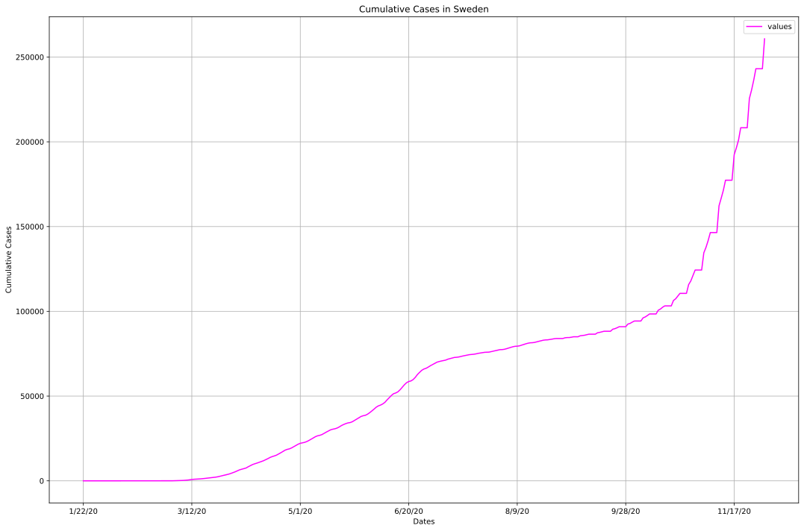


```python
ax = sweden.diff(axis=0).plot(kind='bar', figsize=(18, 12), color="firebrick")
font = {'font.family' : 'serif',
        'font.size'   : 14,
        'font.weight' : 'normal'}
plt.title("New Cases in Sweden")
plt.rcParams.update(font)
ax.get_legend().remove()
plt.ylabel("New Cases")
plt.xlabel("Dates")
ax.set_xticks(np.arange(0, sweden.shape[0], 20))
```


    [<matplotlib.axis.XTick at 0x239d07a8108>,
     <matplotlib.axis.XTick at 0x239d07337c8>,
     <matplotlib.axis.XTick at 0x239d07dbe08>,
     <matplotlib.axis.XTick at 0x239d0b697c8>,
     <matplotlib.axis.XTick at 0x239d0b70548>,
     <matplotlib.axis.XTick at 0x239d0b70dc8>,
     <matplotlib.axis.XTick at 0x239d0b75748>,
     <matplotlib.axis.XTick at 0x239d0b79148>,
     <matplotlib.axis.XTick at 0x239d0b79a08>,
     <matplotlib.axis.XTick at 0x239d075b988>,
     <matplotlib.axis.XTick at 0x239d0b695c8>,
     <matplotlib.axis.XTick at 0x239d0b7f988>,
     <matplotlib.axis.XTick at 0x239d0b84688>,
     <matplotlib.axis.XTick at 0x239d0b87088>,
     <matplotlib.axis.XTick at 0x239d0b87d08>,
     <matplotlib.axis.XTick at 0x239d0b8b888>]


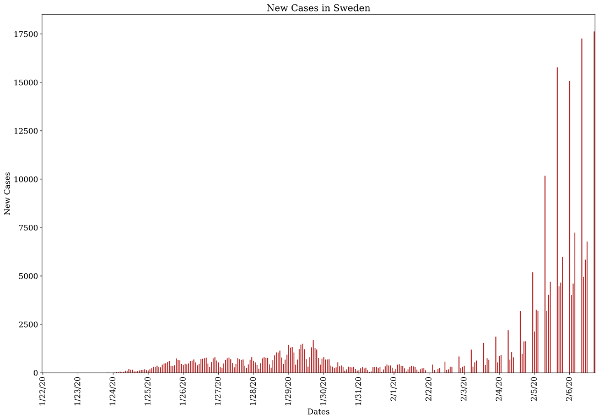


```python
gb.head()
```


<div>
<style scoped>
    .dataframe tbody tr th:only-of-type {
        vertical-align: middle;
    }

    .dataframe tbody tr th {
        vertical-align: top;
    }

    .dataframe thead th {
        text-align: right;
    }
</style>
<table border="1" class="dataframe">
  <thead>
    <tr style="text-align: right;">
      <th></th>
      <th>Province/State</th>
      <th>Country/Region</th>
      <th>Lat</th>
      <th>Long</th>
      <th>1/22/20</th>
      <th>1/23/20</th>
      <th>1/24/20</th>
      <th>1/25/20</th>
      <th>1/26/20</th>
      <th>1/27/20</th>
      <th>...</th>
      <th>11/22/20</th>
      <th>11/23/20</th>
      <th>11/24/20</th>
      <th>11/25/20</th>
      <th>11/26/20</th>
      <th>11/27/20</th>
      <th>11/28/20</th>
      <th>11/29/20</th>
      <th>11/30/20</th>
      <th>12/1/20</th>
    </tr>
  </thead>
  <tbody>
    <tr>
      <th>0</th>
      <td>NaN</td>
      <td>Afghanistan</td>
      <td>33.93911</td>
      <td>67.709953</td>
      <td>0</td>
      <td>0</td>
      <td>0</td>
      <td>0</td>
      <td>0</td>
      <td>0</td>
      <td>...</td>
      <td>44706</td>
      <td>44988</td>
      <td>45280</td>
      <td>45490</td>
      <td>45716</td>
      <td>45839</td>
      <td>45966</td>
      <td>46215</td>
      <td>46498</td>
      <td>46717</td>
    </tr>
    <tr>
      <th>1</th>
      <td>NaN</td>
      <td>Albania</td>
      <td>41.15330</td>
      <td>20.168300</td>
      <td>0</td>
      <td>0</td>
      <td>0</td>
      <td>0</td>
      <td>0</td>
      <td>0</td>
      <td>...</td>
      <td>32761</td>
      <td>33556</td>
      <td>34300</td>
      <td>34944</td>
      <td>35600</td>
      <td>36245</td>
      <td>36790</td>
      <td>37625</td>
      <td>38182</td>
      <td>39014</td>
    </tr>
    <tr>
      <th>2</th>
      <td>NaN</td>
      <td>Algeria</td>
      <td>28.03390</td>
      <td>1.659600</td>
      <td>0</td>
      <td>0</td>
      <td>0</td>
      <td>0</td>
      <td>0</td>
      <td>0</td>
      <td>...</td>
      <td>74862</td>
      <td>75867</td>
      <td>77000</td>
      <td>78025</td>
      <td>79110</td>
      <td>80168</td>
      <td>81212</td>
      <td>82221</td>
      <td>83199</td>
      <td>84152</td>
    </tr>
    <tr>
      <th>3</th>
      <td>NaN</td>
      <td>Andorra</td>
      <td>42.50630</td>
      <td>1.521800</td>
      <td>0</td>
      <td>0</td>
      <td>0</td>
      <td>0</td>
      <td>0</td>
      <td>0</td>
      <td>...</td>
      <td>6256</td>
      <td>6304</td>
      <td>6351</td>
      <td>6428</td>
      <td>6534</td>
      <td>6610</td>
      <td>6610</td>
      <td>6712</td>
      <td>6745</td>
      <td>6790</td>
    </tr>
    <tr>
      <th>4</th>
      <td>NaN</td>
      <td>Angola</td>
      <td>-11.20270</td>
      <td>17.873900</td>
      <td>0</td>
      <td>0</td>
      <td>0</td>
      <td>0</td>
      <td>0</td>
      <td>0</td>
      <td>...</td>
      <td>14493</td>
      <td>14634</td>
      <td>14742</td>
      <td>14821</td>
      <td>14920</td>
      <td>15008</td>
      <td>15087</td>
      <td>15103</td>
      <td>15139</td>
      <td>15251</td>
    </tr>
  </tbody>
</table>
<p>5 rows × 319 columns</p>
</div>


```python
print(gb[gb["Country/Region"] == "Canada"]["Province/State"])
```

    39                      Alberta
    40             British Columbia
    41             Diamond Princess
    42               Grand Princess
    43                     Manitoba
    44                New Brunswick
    45    Newfoundland and Labrador
    46        Northwest Territories
    47                  Nova Scotia
    48                      Nunavut
    49                      Ontario
    50         Prince Edward Island
    51                       Quebec
    52       Repatriated Travellers
    53                 Saskatchewan
    54                        Yukon
    Name: Province/State, dtype: object
    

# COVID-19 Analysis
## British Columbia
I was born and raised in Vancouver, BC. My entire family currently resides in BC. Moreover, there are plenty of COVID-related datasets for the residents of BC. As such, I will restrict my analysis to the impact of COVID-19 on the province of British Columbia. Prior to breaking into an analysis of BC, I will begin by illustrating the impact of COVID-19 on Canada as a whole. 


```python
canada = create_time_series(gb, get_index(gb, "Canada"))
ax = canada.plot(figsize=(18, 12), color="royalblue")
font = {'font.family' : 'serif',
        'font.size'   : 14,
        'font.weight' : 'normal'}

plt.rcParams.update(font)
plt.title("Visualization of COVID-19 Cumulative Cases & Policies in Canada")
plt.xlabel("Dates")
plt.ylabel("Cumulative Case Counts")
plt.ylim(bottom=0)
plt.legend()
plt.grid(False)

# Critical Events: https://www.canadianhealthcarenetwork.ca/covid-19-a-canadian-timeline, https://www.cihi.ca/en/covid-19-intervention-timeline-in-canada 
canada = canada.reset_index()
# First case of COVID-19 in Canada
fc_date = "1/25/20"
fc_line = ax.axvline(x=canada[canada["dates"] == fc_date].index[0], color="red", linewidth=0.5)

# Beginning of Travel Bans
tb_date = "2/28/20"
tb_line = ax.axvline(x=canada[canada["dates"] == tb_date].index[0], color="darkcyan", linewidth=0.5)

# Work from home policies
wfh_date = "3/10/20"
wfh_line = ax.axvline(x=canada[canada["dates"] == wfh_date].index[0], color="indigo", linewidth=0.5)

# Self isolation guidelines
si_date = "3/11/20"
si_line = ax.axvline(x=canada[canada["dates"] == si_date].index[0], color="darkred", linewidth=0.5)

# Mask guidelines
mg_date = "3/26/20"
mg_line = ax.axvline(x=canada[canada["dates"] == mg_date].index[0], color="magenta", linewidth=0.5)

# Mask recommendation
mr_date = "4/7/20"
mr_line = ax.axvline(x=canada[canada["dates"] == mr_date].index[0], color="darkgreen", linewidth=0.5)

# Mandatory masks for air travel
mma_date = "4/17/20"
mma_line = ax.axvline(x=canada[canada["dates"] == mma_date].index[0], color="midnightblue", linewidth=0.5)

# First serological COVID test
st_date = "5/12/20"
st_line = ax.axvline(x=canada[canada["dates"] == st_date].index[0], color="sienna", linewidth=0.5)

# Mandatory masks for transportation sector workers
mmt_date = "6/4/20"
mmt_line = ax.axvline(x=canada[canada["dates"] == mmt_date].index[0], color="darkblue", linewidth=0.5)

# National contact tracing app
nct_date = "6/18/20"
nct_line = ax.axvline(x=canada[canada["dates"] == nct_date].index[0], color="saddlebrown", linewidth=0.5)

# Air traveller screening
ats_date = "6/30/20"
ats_line = ax.axvline(x=canada[canada["dates"] == ats_date].index[0], color="slategray", linewidth=0.5)

plt.legend(["Cumulative COVID-19 Cases", "1/25/2020 First Canadian Case", "2/28/2020 Beginning of Travel Bans", "3/10/20 Work From Home Guidelines", "3/11/20 Self Isolation Guidelines", "3/26/20 Mask Guidelines", "4/7/20 Mask Recommendations", "4/17/20 Mandatory Masks for Air/Rail Travel", "5/12/20 First Seralogical COVID Test", "6/4/20 Mandatory Masks for Transportation Workers", "6/18/20 Contact Tracing App", "6/30/20 Air Traveller Screening"])

plt.show()
```


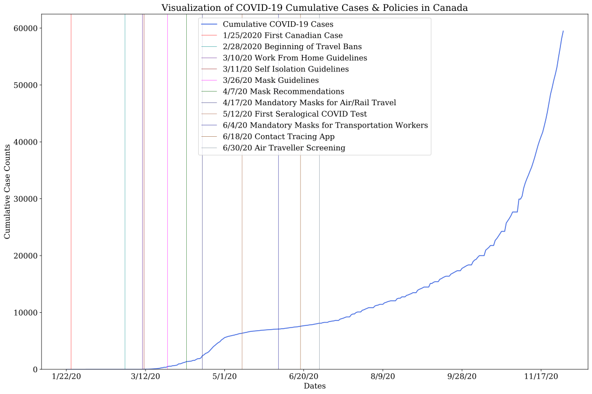


```python
canada = create_time_series(gb, get_index(gb, "Canada"))
ax = canada.diff(axis=0).plot(kind="bar", figsize=(18, 12))
font = {'font.family' : 'serif',
        'font.size'   : 14,
        'font.weight' : 'normal'}

plt.rcParams.update(font)
plt.title("Visualization of New COVID-19 Cases & Policies in Canada")
plt.xlabel("Dates")
plt.ylabel("New Cases")
plt.legend()
ax.set_xticks(np.arange(0, canada.shape[0], 28))
plt.grid(False)

canada = canada.reset_index()

# First case of COVID-19 in Canada
fc_date = "1/25/20"
fc_line = ax.axvline(x=canada[canada["dates"] == fc_date].index[0], color="red", linewidth=0.5)

# Beginning of Travel Bans
tb_date = "2/28/20"
tb_line = ax.axvline(x=canada[canada["dates"] == tb_date].index[0], color="darkcyan", linewidth=0.5)

# Work from home policies
wfh_date = "3/10/20"
wfh_line = ax.axvline(x=canada[canada["dates"] == wfh_date].index[0], color="indigo", linewidth=0.5)

# Self isolation guidelines
si_date = "3/11/20"
si_line = ax.axvline(x=canada[canada["dates"] == si_date].index[0], color="darkred", linewidth=0.5)

# Mask guidelines
mg_date = "3/26/20"
mg_line = ax.axvline(x=canada[canada["dates"] == mg_date].index[0], color="magenta", linewidth=0.5)

# Mask recommendation
mr_date = "4/7/20"
mr_line = ax.axvline(x=canada[canada["dates"] == mr_date].index[0], color="darkgreen", linewidth=0.5)

# Mandatory masks for air travel
mma_date = "4/17/20"
mma_line = ax.axvline(x=canada[canada["dates"] == mma_date].index[0], color="midnightblue", linewidth=0.5)

# First serological COVID test
st_date = "5/12/20"
st_line = ax.axvline(x=canada[canada["dates"] == st_date].index[0], color="sienna", linewidth=0.5)

# Mandatory masks for transportation sector workers
mmt_date = "6/4/20"
mmt_line = ax.axvline(x=canada[canada["dates"] == mmt_date].index[0], color="darkblue", linewidth=0.5)

# National contact tracing app
nct_date = "6/18/20"
nct_line = ax.axvline(x=canada[canada["dates"] == nct_date].index[0], color="saddlebrown", linewidth=0.5)

# Air traveller screening
ats_date = "6/30/20"
ats_line = ax.axvline(x=canada[canada["dates"] == ats_date].index[0], color="slategray", linewidth=0.5)

plt.legend(["1/25/2020 First Canadian Case", "2/28/2020 Beginning of Travel Bans", "3/10/20 Work From Home Guidelines", "3/11/20 Self Isolation Guidelines", "3/26/20 Mask Guidelines", "4/7/20 Mask Recommendations", "4/17/20 Mandatory Masks for Air/Rail Travel", "5/12/20 First Seralogical COVID Test", "6/4/20 Mandatory Masks for Transportation Workers", "6/18/20 Contact Tracing App", "6/30/20 Air Traveller Screening"])

plt.show()
```


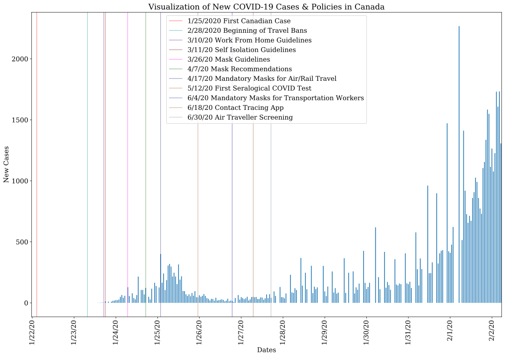


From the above plots, we can see that the measures implemented accross Canada in April and May flattened the curve. Unforunately, these measures only temporarily slowed the spread down. By observing the above Figures, we notice that the number of infected persons is increasing exponentially.

We will now break down the spread of the virus provincially:


```python
canada = gb[gb["Country/Region"] == "Canada"]
provinces = canada["Province/State"].unique()

province_colors = ["teal", "indigo", "orange", "olivedrab", "limegreen", "royalblue", "thistle", "darkmagenta", "gold", "olivedrab", "indianred", "deepskyblue", "hotpink", "tan", "khaki", "darkmagenta"]

plt.figure(figsize=(18, 12))

for i in range(len(provinces)):
    province_df = canada[canada["Province/State"] == provinces[i]].transpose()[4:]
    plt.plot(province_df, label=provinces[i], color=province_colors[i])

font = {'font.family' : 'serif',
        'font.size'   : 14,
        'font.weight' : 'normal'}
ax = plt.gca()
ax.set_xticks(np.arange(province_df.shape[0], step=30))
plt.rcParams.update(font)
plt.title("COVID-19 Cumulative Cases Provincially in Canada")
plt.xlabel("Dates")
plt.ylabel("Cumulative Case Counts")
plt.ylim(bottom=0)
plt.legend()
plt.grid(True)
plt.show()
```


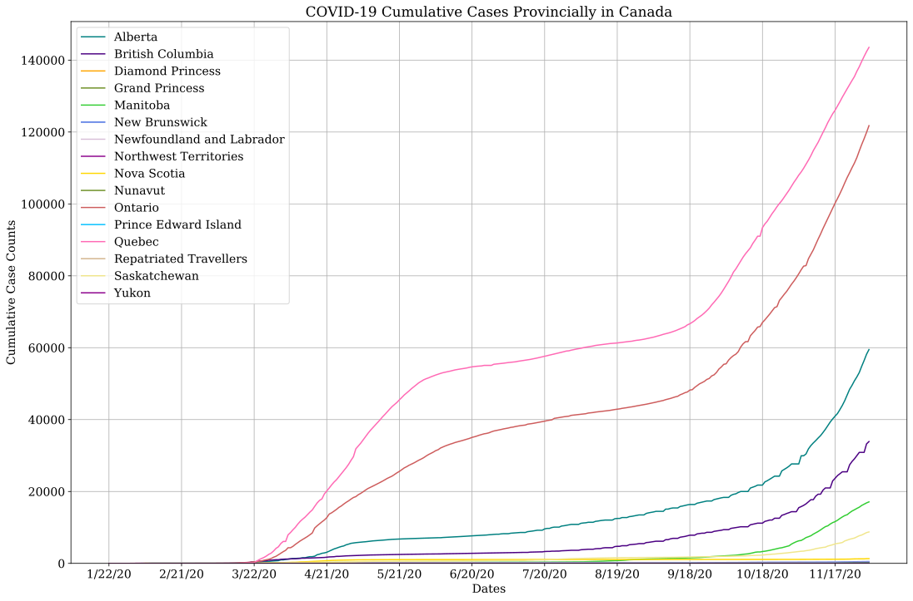


From the plot above, we can see that the provinces hit the hardest by the virus are Quebec and Ontario followed by Alberta, British Columbia, and Manitoba. The purpose of this plot was to visualize the provincial transmission rates, but also to make sure that there was sufficient data for an analysis of BC. Since there is, we will now define our prediction model. 

# BC Modelling
Since we are restricting our analysis to BC, we will now fit a model to the time-series data. Our visualizations depend on the model that we wish to implement. We could use an exponential model given the apparent exponential nature shown in the above Figure. We could also use a sigmoid fit which has been exhibited by other countries. Instead, we will fit an SIR model to the BC time series data. We will use an SIR model because it will mimic an exponential fit until the number of susceptible individuals has sufficiently decreased. An SIR model will also provide stronger long-term predictions and more freedom with respect to the model tuning. This model is a credible model because it has been used several times to model viruses and COVID, specifically (https://www.ncbi.nlm.nih.gov/pmc/articles/PMC7321055/#:~:text=Assuming%20the%20published%20data%20are,the%20number%20of%20susceptible%20individuals., https://journals.plos.org/plosone/article?id=10.1371/journal.pone.0237832)

Prior to implementing our SIR model, we will explain the specifics of the SIR model so that we can obtain a good understanding as to the information we need to create one. 

# SIR Modelling
## SIR Model Explained
There are three variables that the SIR model depends on, $S$, $I$, and $R$. $S(t)$ is the number of susceptible individuals, $I(t)$ is the number of infected individuals, and $R(t)$ is the number of recovered individuals. We define the following variables to make our future calculations more simple:

$s(t) = \frac{S(t)}{N}$  
$i(t) = \frac{I(t)}{N}$  
$r(t) = \frac{R(t)}{N}$

### Model Assumptions
- The total number of individuals in the population, $N$, is constant
- Individuals do not immigrate to or from the population in question
- There are no births
- There is no loss of immunity (we could assume a loss of immunity and derive different equations)


Since the total number of individuals in the population, $N$, is constant $s(t) + i(t) + r(t) = 1$ because $S(t) + I(t) + R(t) = N$. Given our assumptions, we are effectively assuming that the only way an individual leaves the susceptible group is by becoming infected. Thus, the number of susceptible individuals is always decreasing. 

$\frac{dS}{dt} = -b s(t) I(t) \implies \frac{ds}{dt} = \frac{-b s(t) I(t)}{N}$  

$\frac{ds}{dt} = -b s(t) i(t)$

The $i(t)$ factor is present because given our assumption, if there is just one infected person then the number of susceptible people decreases by a factor of $b s(t)$. Therefore, if there are 2 infected people, then the number of susceptible people decreases by a factor of $2b s(t)$. For $I(t)$ infected people, the number of susceptible people decreases by a factor of $b \hspace{0.5mm} s(t) I(t)$. 

$\frac{dR}{dt} = k I(t) \implies \frac{dr}{dt} = k i(t)$

This follows from the fact that $k$ infected individuals recover every day. Now, since the number of infected people increases as a function of $b \hspace{0.5mm} s(t) I(t)$ and $k \hspace{0.5mm} I(t)$, we have the following:

$\frac{dI}{dt} = -k I(t) + b s(t) I(t) \implies \frac{dI}{dt} = -\frac{dR}{dt} - \frac{dS}{dt} \implies \frac{ds}{dt} + \frac{di}{dt} + \frac{dr}{dt} = 0$

### Initial Conditions
To solve this set of differential equations, we need to supply some initial conditions. We assume that a tiny fraction of our population is infected and the rest of our population is healthy. Thus, for a population of size 5,000,000, we have the following:

$S(0) = 4,999,990$
$I(0) = 10$
$R(0) = 0$

$s(0) = 0.999998 \approx 1$
$i(0) = 2 x 10^{-6}$
$r(0) = 0$

### Euler's Method
We do not numerically solve the SIR equations. Instead, we use Euler's method. For a single time dependent variable, $x$, Euler's method is as follows:

$x_i = x_{i-1} + \frac{dx(t-1)}{dt} \cdot \Delta t$

Since we have three variables in the context of the SIR model, we have three Euler formulas:

$s_i = s_{i-1} + \frac{ds}{dt}\Bigr|_{i-1} \cdot \Delta t$
$i_i = i_{i-1} + \frac{di}{dt}\Bigr|_{i-1}  \cdot \Delta t$
$r_i = r_{i-1} + \frac{dr}{dt}\Bigr|_{i-1}  \cdot \Delta t$

Given the SIR differential equations, we have:

$s_i = s_{i-1} - b \hspace{0.5mm} s_{i-1} i_{i-1} \cdot \Delta t$
$i_i = i_{i-1} + (- k i_{i-1} + b \hspace{0.5mm} s_{i-1} i_{i-1}) \cdot \Delta t$
$r_i = r_{i-1} + k \hspace{0.5mm} i_{i-1} \cdot \Delta t$

### Finding Optimal Parameters for a Dataset
There are a few ways to go about this. The first way is to estimate $b$ and $k$ based on the recovery rate and $R$ value typically associated with an SIR outbreak. The other way, which is far more involved, is to define a loss function between the predictions of the model and the data. Then, compute the sum of that loss function over all of the observations. This method gives us a way to quantify the difference between our model's predictions and the data. Using this method, we can then perform a grid search over all of the possible parameters to obtain the optimal model. 

# SIR Model Implementation
To implement the model, we require a few things. We need the number of people that are infected and the number of people that have recovered. Using this information and our assumptions, we can determine how many people are susceptible. We also need to know the factors $b$ and $k$ which characterize how many susceptible persons one infected person transfers the virus to and how quickly an infected person recovers, respectively. To obtain these parameters, we will first make a reasonable guess. Then, we will perform grid search around the parameters close to our guess.

## SIR Data Extraction
Prior to doing any of this, we need to extract the relevant data from the online sources.


```python
# cumulative BC case counts from provided data 
bc = gb[gb["Province/State"] == "British Columbia"].iloc[:, 4:].transpose()
bc.rename(columns={40:"values"}, inplace=True)
bc.head()
```

              values
    11/27/20   30884
    11/28/20   30884
    11/29/20   30884
    11/30/20   33238
    12/1/20    33894
    


```python
# extracting recovered persons data from https://github.com/CSSEGISandData/COVID-19/blob/master/csse_covid_19_data/csse_covid_19_time_series/time_series_covid19_recovered_global.csv
gb_rec = pd.read_csv("../data/time_series_covid19_recovered_global.csv")
gb_rec.head()
```


<div>
<style scoped>
    .dataframe tbody tr th:only-of-type {
        vertical-align: middle;
    }

    .dataframe tbody tr th {
        vertical-align: top;
    }

    .dataframe thead th {
        text-align: right;
    }
</style>
<table border="1" class="dataframe">
  <thead>
    <tr style="text-align: right;">
      <th></th>
      <th>Province/State</th>
      <th>Country/Region</th>
      <th>Lat</th>
      <th>Long</th>
      <th>1/22/20</th>
      <th>1/23/20</th>
      <th>1/24/20</th>
      <th>1/25/20</th>
      <th>1/26/20</th>
      <th>1/27/20</th>
      <th>...</th>
      <th>12/2/20</th>
      <th>12/3/20</th>
      <th>12/4/20</th>
      <th>12/5/20</th>
      <th>12/6/20</th>
      <th>12/7/20</th>
      <th>12/8/20</th>
      <th>12/9/20</th>
      <th>12/10/20</th>
      <th>12/11/20</th>
    </tr>
  </thead>
  <tbody>
    <tr>
      <th>0</th>
      <td>NaN</td>
      <td>Afghanistan</td>
      <td>33.93911</td>
      <td>67.709953</td>
      <td>0</td>
      <td>0</td>
      <td>0</td>
      <td>0</td>
      <td>0</td>
      <td>0</td>
      <td>...</td>
      <td>37218</td>
      <td>37260</td>
      <td>37260</td>
      <td>37393</td>
      <td>37685</td>
      <td>37879</td>
      <td>37920</td>
      <td>38032</td>
      <td>38099</td>
      <td>38141</td>
    </tr>
    <tr>
      <th>1</th>
      <td>NaN</td>
      <td>Albania</td>
      <td>41.15330</td>
      <td>20.168300</td>
      <td>0</td>
      <td>0</td>
      <td>0</td>
      <td>0</td>
      <td>0</td>
      <td>0</td>
      <td>...</td>
      <td>19912</td>
      <td>20484</td>
      <td>20974</td>
      <td>21286</td>
      <td>21617</td>
      <td>22180</td>
      <td>22527</td>
      <td>23072</td>
      <td>23609</td>
      <td>24136</td>
    </tr>
    <tr>
      <th>2</th>
      <td>NaN</td>
      <td>Algeria</td>
      <td>28.03390</td>
      <td>1.659600</td>
      <td>0</td>
      <td>0</td>
      <td>0</td>
      <td>0</td>
      <td>0</td>
      <td>0</td>
      <td>...</td>
      <td>54990</td>
      <td>55538</td>
      <td>56079</td>
      <td>56617</td>
      <td>57146</td>
      <td>57648</td>
      <td>58146</td>
      <td>58146</td>
      <td>59135</td>
      <td>59590</td>
    </tr>
    <tr>
      <th>3</th>
      <td>NaN</td>
      <td>Andorra</td>
      <td>42.50630</td>
      <td>1.521800</td>
      <td>0</td>
      <td>0</td>
      <td>0</td>
      <td>0</td>
      <td>0</td>
      <td>0</td>
      <td>...</td>
      <td>5988</td>
      <td>6066</td>
      <td>6130</td>
      <td>6171</td>
      <td>6238</td>
      <td>6293</td>
      <td>6367</td>
      <td>6452</td>
      <td>6505</td>
      <td>6598</td>
    </tr>
    <tr>
      <th>4</th>
      <td>NaN</td>
      <td>Angola</td>
      <td>-11.20270</td>
      <td>17.873900</td>
      <td>0</td>
      <td>0</td>
      <td>0</td>
      <td>0</td>
      <td>0</td>
      <td>0</td>
      <td>...</td>
      <td>8139</td>
      <td>8244</td>
      <td>8299</td>
      <td>8335</td>
      <td>8338</td>
      <td>8353</td>
      <td>8470</td>
      <td>8579</td>
      <td>8679</td>
      <td>8798</td>
    </tr>
  </tbody>
</table>
<p>5 rows × 329 columns</p>
</div>


```python
# provided dataset does not include any information about BC
gb_rec[gb_rec["Country/Region"] == "Canada"].head()
```


<div>
<style scoped>
    .dataframe tbody tr th:only-of-type {
        vertical-align: middle;
    }

    .dataframe tbody tr th {
        vertical-align: top;
    }

    .dataframe thead th {
        text-align: right;
    }
</style>
<table border="1" class="dataframe">
  <thead>
    <tr style="text-align: right;">
      <th></th>
      <th>Province/State</th>
      <th>Country/Region</th>
      <th>Lat</th>
      <th>Long</th>
      <th>1/22/20</th>
      <th>1/23/20</th>
      <th>1/24/20</th>
      <th>1/25/20</th>
      <th>1/26/20</th>
      <th>1/27/20</th>
      <th>...</th>
      <th>12/2/20</th>
      <th>12/3/20</th>
      <th>12/4/20</th>
      <th>12/5/20</th>
      <th>12/6/20</th>
      <th>12/7/20</th>
      <th>12/8/20</th>
      <th>12/9/20</th>
      <th>12/10/20</th>
      <th>12/11/20</th>
    </tr>
  </thead>
  <tbody>
    <tr>
      <th>39</th>
      <td>NaN</td>
      <td>Canada</td>
      <td>56.1304</td>
      <td>-106.3468</td>
      <td>0</td>
      <td>0</td>
      <td>0</td>
      <td>0</td>
      <td>0</td>
      <td>0</td>
      <td>...</td>
      <td>314529</td>
      <td>319250</td>
      <td>324802</td>
      <td>329676</td>
      <td>334375</td>
      <td>344034</td>
      <td>349629</td>
      <td>355401</td>
      <td>361020</td>
      <td>367837</td>
    </tr>
  </tbody>
</table>
<p>1 rows × 329 columns</p>
</div>


```python
# examining online BC datasets: http://www.bccdc.ca/health-info/diseases-conditions/covid-19/data
bc_db = pd.read_csv("../data/bc/BCCDC_COVID19_Dashboard_Case_Details.csv")
print(bc_db.shape)
print(bc_db.head())
print(bc_db.tail())
```

    (40797, 5)
      Reported_Date                 HA Sex Age_Group Classification_Reported
    0    2020-01-26      Out of Canada   M     40-49           Lab-diagnosed
    1    2020-02-02  Vancouver Coastal   F     50-59           Lab-diagnosed
    2    2020-02-05      Out of Canada   F     20-29           Lab-diagnosed
    3    2020-02-05      Out of Canada   M     30-39           Lab-diagnosed
    4    2020-02-11           Interior   F     30-39           Lab-diagnosed
          Reported_Date                 HA Sex Age_Group Classification_Reported
    40792    2020-12-11  Vancouver Coastal   U   Unknown           Lab-diagnosed
    40793    2020-12-11  Vancouver Coastal   U   Unknown           Lab-diagnosed
    40794    2020-12-11  Vancouver Coastal   U   Unknown           Lab-diagnosed
    40795    2020-12-11  Vancouver Coastal   U   Unknown           Lab-diagnosed
    40796    2020-12-11  Vancouver Coastal   F     30-39           Lab-diagnosed
    

This dataset tracks when each individual was diagnosed with COVID, where the diagnosis took place, and some other properties of the diagnosis that may be useful. 


```python
print(bc_db.Classification_Reported.unique())
```

    ['Lab-diagnosed' 'Epi-linked']
    


```python
bc_db_lab = pd.read_csv("../data/bc/BCCDC_COVID19_Dashboard_Lab_Information.csv")
print(bc_db_lab.shape)
print(bc_db_lab.head())
print(bc_db_lab.tail())
```

    (2254, 6)
             Date    Region  New_Tests  Total_Tests  Positivity  Turn_Around
    0  2020-01-23        BC          2            2         0.0         32.0
    1  2020-01-23    Fraser          0            0         0.0          0.0
    2  2020-01-23  Interior          0            0         0.0          0.0
    3  2020-01-23  Northern          0            0         0.0          0.0
    4  2020-01-23   Unknown          0            0         0.0          0.0
                Date             Region  New_Tests  Total_Tests  Positivity  \
    2249  2020-12-10           Interior       1335       130668        6.61   
    2250  2020-12-10           Northern        379        37621       10.34   
    2251  2020-12-10            Unknown         68        25639        0.00   
    2252  2020-12-10  Vancouver Coastal       2543       400235        4.44   
    2253  2020-12-10   Vancouver Island       1150       143159        0.99   
    
          Turn_Around  
    2249         23.9  
    2250         28.4  
    2251         53.1  
    2252         21.8  
    2253         13.0  
    


```python
print(bc_db_lab.columns)
print(bc_db_lab[bc_db_lab["Date"] == "2020-01-23"][["Date", "Region", "New_Tests", "Total_Tests", "Positivity"]], "\n")

print(bc_db_lab[bc_db_lab["Date"] == "2020-01-25"][["Date", "Region", "New_Tests", "Total_Tests", "Positivity"]], "\n")

print(bc_db_lab[bc_db_lab["Date"] == "2020-01-26"][["Date", "Region", "New_Tests", "Total_Tests", "Positivity"]], "\n")

print(bc_db_lab[bc_db_lab["Date"] == "2020-01-27"][["Date", "Region", "New_Tests", "Total_Tests", "Positivity"]], "\n")

print(bc_db_lab[bc_db_lab["Date"] == "2020-01-28"][["Date", "Region", "New_Tests", "Total_Tests", "Positivity"]], "\n")

print(bc_db_lab[bc_db_lab["Date"] == "2020-05-28"][["Date", "Region", "New_Tests", "Total_Tests", "Positivity"]], "\n")
```

    Index(['Date', 'Region', 'New_Tests', 'Total_Tests', 'Positivity',
           'Turn_Around'],
          dtype='object')
             Date             Region  New_Tests  Total_Tests  Positivity
    0  2020-01-23                 BC          2            2         0.0
    1  2020-01-23             Fraser          0            0         0.0
    2  2020-01-23           Interior          0            0         0.0
    3  2020-01-23           Northern          0            0         0.0
    4  2020-01-23            Unknown          0            0         0.0
    5  2020-01-23  Vancouver Coastal          2            2         0.0
    6  2020-01-23   Vancouver Island          0            0         0.0 
    
              Date             Region  New_Tests  Total_Tests  Positivity
    7   2020-01-25                 BC          4            6         0.0
    8   2020-01-25             Fraser          3            3         0.0
    9   2020-01-25           Interior          0            0         0.0
    10  2020-01-25           Northern          0            0         0.0
    11  2020-01-25            Unknown          0            0         0.0
    12  2020-01-25  Vancouver Coastal          0            0         0.0
    13  2020-01-25   Vancouver Island          1            1         0.0 
    
              Date             Region  New_Tests  Total_Tests  Positivity
    14  2020-01-26                 BC         20           26         0.0
    15  2020-01-26             Fraser         12           15         0.0
    16  2020-01-26           Interior          0            0         0.0
    17  2020-01-26           Northern          0            0         0.0
    18  2020-01-26            Unknown          2            2         0.0
    19  2020-01-26  Vancouver Coastal          6            8         0.0
    20  2020-01-26   Vancouver Island          0            0         0.0 
    
              Date             Region  New_Tests  Total_Tests  Positivity
    21  2020-01-27                 BC         10           36         0.0
    22  2020-01-27             Fraser          2           17         0.0
    23  2020-01-27           Interior          0            0         0.0
    24  2020-01-27           Northern          0            0         0.0
    25  2020-01-27            Unknown          3            5         0.0
    26  2020-01-27  Vancouver Coastal          5           13         0.0
    27  2020-01-27   Vancouver Island          0            0         0.0 
    
              Date             Region  New_Tests  Total_Tests  Positivity
    28  2020-01-28                 BC          3           39         0.0
    29  2020-01-28             Fraser          3           20         0.0
    30  2020-01-28           Interior          0            0         0.0
    31  2020-01-28           Northern          0            0         0.0
    32  2020-01-28            Unknown          0            0         0.0
    33  2020-01-28  Vancouver Coastal          0            0         0.0
    34  2020-01-28   Vancouver Island          0            0         0.0 
    
               Date             Region  New_Tests  Total_Tests  Positivity
    875  2020-05-28                 BC       1993       141410        0.80
    876  2020-05-28             Fraser        727        51174        1.54
    877  2020-05-28           Interior        275        20257        0.06
    878  2020-05-28           Northern        103         6041        0.95
    879  2020-05-28            Unknown          3          456        0.00
    880  2020-05-28  Vancouver Coastal        588        42139        0.64
    881  2020-05-28   Vancouver Island        297        21343        0.00 
    
    

This dataset includes the number of COVID tests conducted in every region in BC almost every day. It also shows how many of those tests were positive. Currently, we have precise data with respect to the number of infected. We do not, however, have any information about the number of recovered persons. 


```python
bc_rs = pd.read_csv("../data/bc/BCCDC_COVID19_Regional_Summary_Data.csv")
print(bc_rs.shape)
print(bc_rs.head())
print(bc_rs.tail())
```

    (8346, 6)
             Date Province      HA          HSDA  Cases_Reported  \
    0  2020-01-26       BC     All           All               0   
    1  2020-01-26       BC  Fraser           All               0   
    2  2020-01-26       BC  Fraser   Fraser East               0   
    3  2020-01-26       BC  Fraser  Fraser North               0   
    4  2020-01-26       BC  Fraser  Fraser South               0   
    
       Cases_Reported_Smoothed  
    0                      0.0  
    1                      0.0  
    2                      0.0  
    3                      0.0  
    4                      0.0  
                Date       Province                HA                      HSDA  \
    8341  2020-12-11             BC  Vancouver Island  Central Vancouver Island   
    8342  2020-12-11             BC  Vancouver Island    North Vancouver Island   
    8343  2020-12-11             BC  Vancouver Island    South Vancouver Island   
    8344  2020-12-11             BC  Vancouver Island                   Unknown   
    8345  2020-12-11  Out of Canada     Out of Canada             Out of Canada   
    
          Cases_Reported  Cases_Reported_Smoothed  
    8341               0                      NaN  
    8342               0                      NaN  
    8343               0                      NaN  
    8344               0                      NaN  
    8345               0                      NaN  
    

This dataset provides summary data for the information included in the other datasets. As such, we must try another source for the data. 


```python
# new data: https://www.canada.ca/en/public-health/services/diseases/2019-novel-coronavirus-infection.html
ca_19 = pd.read_csv("../data/bc/covid19-download.csv")
print(ca_19.shape)
print(ca_19.head())

print(ca_19.tail())
```

    (4197, 35)
       pruid            prname              prnameFR        date  numconf  \
    0     35           Ontario               Ontario  2020-01-31        3   
    1     59  British Columbia  Colombie-Britannique  2020-01-31        1   
    2      1            Canada                Canada  2020-01-31        4   
    3     35           Ontario               Ontario  2020-02-08        3   
    4     59  British Columbia  Colombie-Britannique  2020-02-08        4   
    
       numprob  numdeaths  numtotal  numtested  numrecover  ...  numdeaths_last14  \
    0        0        0.0         3        NaN         NaN  ...               NaN   
    1        0        0.0         1        NaN         NaN  ...               NaN   
    2        0        0.0         4        NaN         NaN  ...               NaN   
    3        0        0.0         3        NaN         NaN  ...               NaN   
    4        0        0.0         4        NaN         NaN  ...               NaN   
    
       ratedeaths_last14  numtotal_last7  ratetotal_last7  numdeaths_last7  \
    0                NaN             NaN              NaN              NaN   
    1                NaN             NaN              NaN              NaN   
    2                NaN             NaN              NaN              NaN   
    3                NaN             NaN              NaN              NaN   
    4                NaN             NaN              NaN              NaN   
    
       ratedeaths_last7  avgtotal_last7  avgincidence_last7  avgdeaths_last7  \
    0               NaN             NaN                 NaN              NaN   
    1               NaN             NaN                 NaN              NaN   
    2               NaN             NaN                 NaN              NaN   
    3               NaN             NaN                 NaN              NaN   
    4               NaN             NaN                 NaN              NaN   
    
       avgratedeaths_last7  
    0                  NaN  
    1                  NaN  
    2                  NaN  
    3                  NaN  
    4                  NaN  
    
    [5 rows x 35 columns]
          pruid                  prname                   prnameFR        date  \
    4192     60                   Yukon                      Yukon  2020-12-11   
    4193     61   Northwest Territories  Territoires du Nord-Ouest  2020-12-11   
    4194     62                 Nunavut                    Nunavut  2020-12-11   
    4195     99  Repatriated travellers        Voyageurs rapatriés  2020-12-11   
    4196      1                  Canada                     Canada  2020-12-11   
    
          numconf  numprob  numdeaths  numtotal   numtested  numrecover  ...  \
    4192       58        0        1.0        58      5723.0        47.0  ...   
    4193       20        0        0.0        20      7031.0        15.0  ...   
    4194      245        0        0.0       245      4804.0       189.0  ...   
    4195       13        0        0.0        13        76.0        13.0  ...   
    4196   448841        0    13251.0    448841  12399310.0    362293.0  ...   
    
          numdeaths_last14  ratedeaths_last14  numtotal_last7  ratetotal_last7  \
    4192               0.0               0.00             7.0            17.13   
    4193               0.0               0.00             5.0            11.15   
    4194               0.0               0.00            39.0           100.57   
    4195               0.0                NaN             0.0              NaN   
    4196            1357.0               3.61         46272.0           123.10   
    
          numdeaths_last7  ratedeaths_last7  avgtotal_last7  avgincidence_last7  \
    4192              0.0              0.00             1.0                2.45   
    4193              0.0              0.00             1.0                1.59   
    4194              0.0              0.00             6.0               14.37   
    4195              0.0               NaN             0.0                 NaN   
    4196            755.0              2.01          6610.0               17.59   
    
          avgdeaths_last7  avgratedeaths_last7  
    4192              0.0                 0.00  
    4193              0.0                 0.00  
    4194              0.0                 0.00  
    4195              0.0                  NaN  
    4196            108.0                 0.29  
    
    [5 rows x 35 columns]
    


```python
print(ca_19.columns)
```

    Index(['pruid', 'prname', 'prnameFR', 'date', 'numconf', 'numprob',
           'numdeaths', 'numtotal', 'numtested', 'numrecover', 'percentrecover',
           'ratetested', 'numtoday', 'percentoday', 'ratetotal', 'ratedeaths',
           'numdeathstoday', 'percentdeath', 'numtestedtoday', 'numrecoveredtoday',
           'percentactive', 'numactive', 'rateactive', 'numtotal_last14',
           'ratetotal_last14', 'numdeaths_last14', 'ratedeaths_last14',
           'numtotal_last7', 'ratetotal_last7', 'numdeaths_last7',
           'ratedeaths_last7', 'avgtotal_last7', 'avgincidence_last7',
           'avgdeaths_last7', 'avgratedeaths_last7'],
          dtype='object')
    

Eureka! This dataset contains the number of confirmed cases, recovered cases, number of casualties, and many other useful columns. We will use this dataset extensively for our SIR analysis. 


```python
bc_19 = ca_19[ca_19["prname"] == "British Columbia"][['date', 'numconf', 'numprob',
       'numdeaths', 'numtotal', 'numtested', 'numrecover', 'percentrecover',
       'ratetested', 'numtoday', 'percentoday', 'ratetotal', 'ratedeaths',
       'numdeathstoday', 'percentdeath', 'numtestedtoday', 'numrecoveredtoday',
       'percentactive', 'numactive', 'rateactive', 'numtotal_last14',
       'ratetotal_last14', 'numdeaths_last14', 'ratedeaths_last14',
       'numtotal_last7', 'ratetotal_last7', 'numdeaths_last7',
       'ratedeaths_last7', 'avgtotal_last7', 'avgincidence_last7',
       'avgdeaths_last7', 'avgratedeaths_last7']]
bc_19.rename(columns={"numconf": "infected", "numdeaths": "dead", "numrecover": "recovered"}, inplace=True)
essentials = ["date", "infected", "recovered", "dead", "numtotal", "numtested"]
print(bc_19.shape)
print(bc_19[essentials].head(), "\n")
print(bc_19[essentials].tail())
```

    (292, 32)
              date  infected  recovered  dead  numtotal  numtested
    1   2020-01-31         1        NaN   0.0         1        NaN
    4   2020-02-08         4        NaN   0.0         4        NaN
    7   2020-02-16         5        NaN   0.0         5        NaN
    10  2020-02-21         6        NaN   0.0         6        NaN
    13  2020-02-24         6        NaN   0.0         6        NaN 
    
                date  infected  recovered   dead  numtotal  numtested
    4122  2020-12-07     38152    27287.0  527.0     38152   828968.0
    4137  2020-12-08     38718    27897.0  543.0     38718   845737.0
    4152  2020-12-09     39337    28448.0  559.0     39337   853460.0
    4167  2020-12-10     40060    28948.0  587.0     40060   859644.0
    4182  2020-12-11     40797    29598.0  598.0     40797   859644.0
    

## SIR Data Visualization
Now, we can design some insightful visuals that will illustrate how the number of infected persons, recovered persons, and passed individuals changed over time in BC. 


```python
bc_19 = bc_19.reset_index()
bc_19_date_indexed = bc_19.set_index("date")
```


```python
visualization_arr = ["infected", "recovered", "dead"]
colors = ["firebrick", "darkgreen", "black"]
ax = bc_19_date_indexed[visualization_arr].plot(figsize=(18, 12), color=colors)
font = {'font.family' : 'serif',
        'font.size'   : 14,
        'font.weight' : 'normal'}

plt.rcParams.update(font)
plt.title("COVID-19 Infected, Recovered, and Dead in BC")
plt.xlabel("Dates")
plt.ylabel("Cumulative Counts")
plt.ylim(bottom=0)
plt.legend()
plt.grid(True)

ax.legend(["Infected", "Recovered", "Dead"])

plt.show()
```


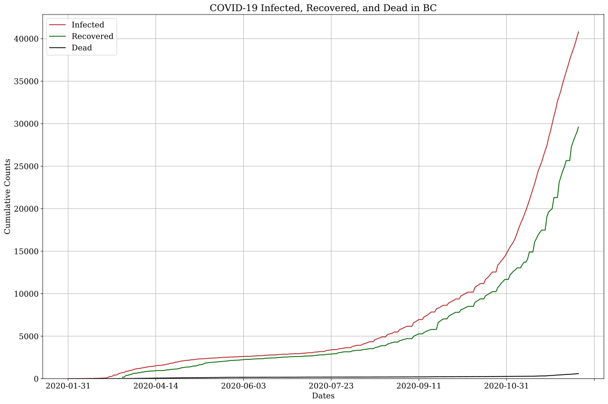


A standard simple SIR model does not take into account the possibility of fatality. Further, an SIR model considers the number of susceptible individuals in a populace as well. 

At this point, we can assume that every person in BC can contract COVID-19. Then, we can use the total population of BC as a starting point for the number of susceptible individuals. Some people are laboring under the delusion that children and young people cannot get COVID. According to the CDC in the US (https://www.cdc.gov/coronavirus/2019-ncov/daily-life-coping/children/symptoms.html), children are typically asymptomatic. This does not mean that they cannot get COVID. This just means that the virus does not manifest itself in the same way that it does in adults or elderly persons. Therefore, it is reasonable to assume that everyone in BC can contract the virus because all age groups are susceptible. As such, we will use the total population of BC as a starting point for the number of susceptible individuals. 

It is important to note that our model is quite ignorant. It does not take into account the interactions between communities. Some of the less dense communities in the interior of BC, for example, have experience 0 COVID cases. Moreover, the majority of the COVID cases in BC are concentrated in Fraser Valley. 

The next assumption we will make is that COVID-19 does not mutate. This assumption is not founded in reality because has mutated frequently since its inception. 

Nonetheless, we will continue with our assumptions and correct any malfeasances present. The graph below illustrates the total number of susceptible, infected, and recovered individuals.


```python
# BC population estimate: https://www2.gov.bc.ca/gov/content/data/statistics/people-population-community/population/population-estimates
susceptible_starting =  5110917

susceptible = np.ones((bc_19.shape[0],))*susceptible_starting

susceptible -= (bc_19["infected"] + bc_19["recovered"] + bc_19["dead"])

bc_19["susceptible"] = susceptible
bc_19_orig = bc_19
bc_19_date_indexed = bc_19.set_index("date")

visualization_arr = ["susceptible", "infected", "recovered", "dead"]
colors = ["darkorange", "firebrick", "darkgreen", "black"]
ax = bc_19_date_indexed[visualization_arr].plot(figsize=(18, 12), color=colors)
font = {'font.family' : 'serif',
        'font.size'   : 14,
        'font.weight' : 'normal'}

plt.rcParams.update(font)
plt.title("COVID-19 SIR + Dead Visualization in BC")
plt.xlabel("Dates")
plt.ylabel("Cumulative Counts")
plt.ylim(bottom=0)
plt.legend()
plt.grid(True)

ax.legend(["Susceptible", "Infected", "Recovered", "Dead"])

plt.show()
```


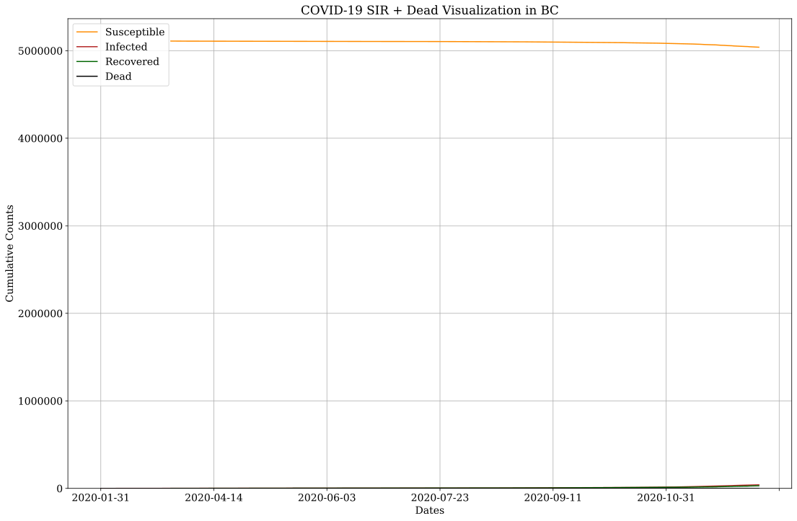


The above visualization puts into perspective the impact of the virus on the population of BC. What follows is an implementation of the SIR model. This implementation is based on the Euler update equations re-stated below:

$s_i = s_{i-1} - b \hspace{0.5mm} s_{i-1} i_{i-1} \cdot \Delta t$  
$i_i = i_{i-1} + (- k i_{i-1} + b \hspace{0.5mm} s_{i-1} i_{i-1}) \cdot \Delta t$  
$r_i = r_{i-1} + k \hspace{0.5mm} i_{i-1} \cdot \Delta t$

## SIR Model Functions
For initial values, we will use the values starting on June 3rd, 2020, as illustrated in the above Figure. There are a few functions that must be created to implement the model. 

The ```create_estimates``` function extends the ```bc_19``` dataset ```projection_length``` into the future. This is important because the projections that we wish to make using the SIR model must be aligned with matching dates. 

The ```s_update```, ```i_update```, and ```r_update``` functions implement the Euler functions described above. These functions are malleable and can work with numpy arrays or Pandas Series objects. 

The ```estimate``` function takes in the ```bc_19``` dataset and parameters $b$ and $k$. Then, it propagates all of the Euler estimates forward starting at the specified starting date. It uses the loss function ```mse_loss``` to compute the MSE between the predictions and the actuals. Note that this loss function computes the sum of the loss between the infected and estimated infected as well as the loss between the recovered and estimated recovered. 

The ```plot_estimates``` function plots the estimates of the infected and recovered next to the actual infected and recovered. The susceptible plot was not included because the number of susceptible individuals is far greater than the number of infected/recovered. The ```plot_sir``` function plots the estimates, projections, and actuals of the susceptible, infected, and recovered. 


```python
bc_19 = bc_19_orig
susceptible_starting = 5110917
projection_length = 100

susceptible = np.ones((bc_19.shape[0],))*susceptible_starting

susceptible -= bc_19["infected"] - bc_19["recovered"] - bc_19["dead"]

bc_19["susceptible"] = susceptible
bc_19 = bc_19[["date", "susceptible", "infected", "recovered", "dead"]]

starting_date = "2020-06-03"
starting_index = bc_19[bc_19["date"] == "2020-06-03"].index[0]

def create_estimates(bc_19, projection_length):
    cur_datetime = datetime.date.fromisoformat("2020-12-11") + datetime.timedelta(days=1)

    for i in range(projection_length):
        bc_19 = bc_19.append({"date": datetime.date.isoformat(cur_datetime)}, ignore_index=True)
        cur_datetime += datetime.timedelta(days=1)

    bc_19_indexed = bc_19.set_index("date")

    est_s = np.zeros((bc_19_indexed.shape[0],))
    est_i = np.zeros((bc_19_indexed.shape[0],))
    est_r = np.zeros((bc_19_indexed.shape[0],))
    est_d = np.zeros((bc_19_indexed.shape[0],))


    est_s[starting_index] = bc_19_indexed["susceptible"][starting_date]
    est_s[:starting_index] = bc_19["susceptible"][:starting_index]

    est_i[starting_index] = bc_19_indexed["infected"][starting_date]
    est_i[:starting_index] = bc_19["infected"][:starting_index]

    est_r[starting_index] = bc_19_indexed["recovered"][starting_date] 
    est_r[:starting_index] = bc_19["recovered"][:starting_index]

    bc_19_indexed["susceptible_est"] = est_s
    bc_19_indexed["infected_est"] = est_i
    bc_19_indexed["recovered_est"] = est_r

    return bc_19_indexed

print(create_estimates(bc_19, 100).shape)
```

    (392, 7)
    


```python
def s_update(s_prev, i_prev, b, dt=1):
    return s_prev - b * s_prev * i_prev * dt

def i_update(s_prev, i_prev, k, b, dt=1):
    return i_prev + (-k * i_prev + b * s_prev * i_prev) * dt

def r_update(r_prev, i_prev, k, dt=1):
    return r_prev + k * i_prev * dt

def mse_loss(actual, predictions):
    return ((actual - predictions)**2).mean(axis=0)

def estimate(bc_19, b, k):
    for i in range(starting_index, bc_19.shape[0]):
        bc_19["susceptible_est"][i] = s_update(bc_19["susceptible_est"][i-1], bc_19["infected_est"][i-1], b)
        bc_19["infected_est"][i] = i_update(bc_19["susceptible_est"][i-1], bc_19["infected_est"][i-1], k, b)
        bc_19["recovered_est"][i] = r_update(bc_19["recovered_est"][i-1], bc_19["infected_est"][i-1], k)
    return bc_19, mse_loss(bc_19["infected"], bc_19["infected_est"]) + mse_loss(bc_19["recovered"], bc_19["recovered_est"])
```


```python
k=35000/susceptible_starting
b=0.0175/susceptible_starting
projection_length = 0
bc_19 = bc_19_orig

susceptible = np.ones((bc_19.shape[0],))*susceptible_starting - (bc_19["infected"] + bc_19["recovered"] + bc_19["dead"])

bc_19["susceptible"] = susceptible
bc_19 = bc_19[["date", "susceptible", "infected", "recovered", "dead"]]

bc_19_indexed = create_estimates(bc_19, 0)

bc_19_indexed, loss = estimate(bc_19_indexed, b, k)
```


```python
def plot_estimates(bc_19_indexed, title="Estimated vs. Actual: Infected and Recovered - COVID19 in BC"):
    visualization_arr = ["infected", "infected_est", "recovered", "recovered_est"]
    colors = ["lightcoral", "darkred", "springgreen", "darkgreen"]
    ax = bc_19_indexed[visualization_arr].plot(figsize=(18, 12), color=colors)
    font = {'font.family' : 'serif',
            'font.size'   : 14,
            'font.weight' : 'normal'}

    bc_19 = bc_19_indexed.reset_index()
    
    ax.axvline(x=bc_19[bc_19["date"] == starting_date].index, color="slategray", linestyle=":", linewidth=2)


    plt.rcParams.update(font)
    plt.title(title)
    plt.xlabel("Dates")
    plt.ylabel("Cumulative Counts")
    plt.ylim(bottom=0)
    plt.legend()
    plt.grid(True)

    ax.legend(["Infected", "Estimated Infected", "Recovered", "Estimated Recovered"])

    plt.show()
# estimates with good estimates determined manually
plot_estimates(bc_19_indexed)
```


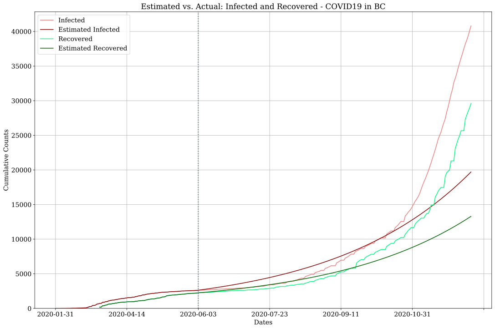


## SIR Hyperparameter Tuning
Guessing the $b$ and $k$ parameters is ineffective because $b$ and $k$ are too granular. As such, we will perform hyperparameter tuning. 

### SIR HP Tuning: June 3rd - 100% of Population
The following assumes that the entire population is susceptible. We will consider a large window of $b$ and $k$ values near our guess. For this part, we will use a starting date of June 3rd, 2020.


```python
good_k_guess=35000/susceptible_starting
good_b_guess=0.0175/susceptible_starting
projection_length = 0
susceptible_starting = 5110917

susceptible = np.ones((bc_19.shape[0],))*susceptible_starting - (bc_19["infected"] + bc_19["recovered"] + bc_19["dead"])

bc_19["susceptible"] = susceptible

bc_19_indexed = create_estimates(bc_19, 0)

min_loss = None
estimates = []

b_reround = 100000

# old loops:
# for b in range(round(0.01*1000), round(0.1*1000), round(0.001*1000)):
# for b in range(round(0.018*b_reround), round(0.03*b_reround), round(0.0001*b_reround)):
# for b in range(round(0.019*b_reround), round(0.024*b_reround), round(0.0001*b_reround)):
#     b = b/b_reround
#     b = b/susceptible_starting
#     for k in range(45000, 47000, 100):
#         k = k/susceptible_starting
#         bc_19_indexed, loss = estimate(bc_19_indexed, b, k)
#         res = {"b (*ss)": round(b*susceptible_starting, 3), "k (*ss)": round(k*susceptible_starting, 3), "loss": loss}
#         if min_loss == None or loss < min_loss:
#             min_loss = loss
#             best_est = res
#         estimates.append(res)

best_est = {'b (*ss)': 0.019, 'k (*ss)': 29000.0, 'loss': 16584571.33733325}
print(best_est)

# good estimates:
# {'b (*ss)': 0.019, 'k (*ss)': 29000.0, 'loss': 16584571.33733325}
# {'b (*ss)': 0.020, 'k (*ss)': 34500.0, 'loss': 12521662.286255158}
# {'b (*ss)': 0.021, 'k (*ss)': 39500.0, 'loss': 10402124.585572464}
# {'b (*ss)': 0.022, 'k (*ss)': 46000.0, 'loss':  9462178.636096675}
```

    {'b (*ss)': 0.019, 'k (*ss)': 29000.0, 'loss': 16584571.33733325}
    


```python
susceptible_starting = 5110917
bc_19_indexed = create_estimates(bc_19, 0)
bc_19_indexed, loss = estimate(bc_19_indexed, 0.022/susceptible_starting, 46000.0/susceptible_starting)
plot_estimates(bc_19_indexed)
```


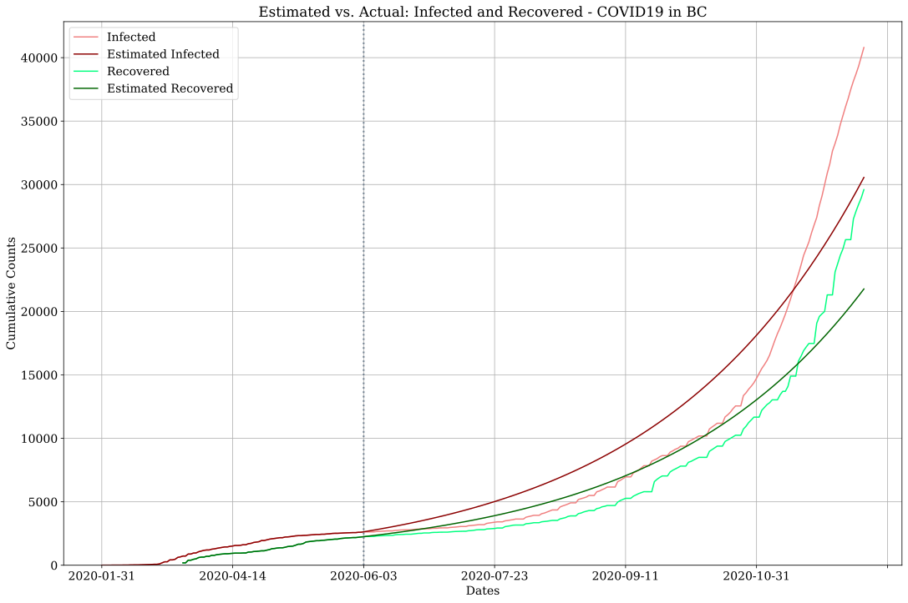


### SIR HP Tuning: June 3rd - 80% of Population
Hyperparameter tuning assuming that 80% of the population is susceptible:


```python
projection_length = 0
susceptible_starting = round(5110917*0.8)

susceptible = np.ones((bc_19.shape[0],))*susceptible_starting - (bc_19["infected"] + bc_19["recovered"] + bc_19["dead"])

bc_19["susceptible"] = susceptible

bc_19_indexed = create_estimates(bc_19, 0)

min_loss = None
estimates = []

b_reround = 100000

# for b in range(round(0.005*b_reround), round(0.05*b_reround), round(0.005*b_reround)):
# for b in range(round(0.02*b_reround), round(0.023*b_reround), round(0.0005*b_reround)):
#     b = b/b_reround
#     b = b/susceptible_starting
#     # for k in range(20000, 60000, 1000):
#     for k in range(32000, 37000, 50):    
#         k = k/susceptible_starting
#         bc_19_indexed, loss = estimate(bc_19_indexed, b, k)
#         res = {"b (*ss)": round(b*susceptible_starting, 3), "k (*ss)": round(k*susceptible_starting, 3), "loss": loss}
#         if min_loss == None or loss < min_loss:
#             min_loss = loss
#             best_est = res
#         estimates.append(res)
        
best_est = {'b (*ss)': 0.022, 'k (*ss)': 35550.0, 'loss': 9537297.732304351}
print(best_est)

# good estimates:
# {'b (*ss)': 0.020, 'k (*ss)': 28000.0, 'loss': 12889495.98618021}
# {'b (*ss)': 0.021, 'k (*ss)': 29500.0, 'loss': 11586985.719439596}
# {'b (*ss)': 0.021, 'k (*ss)': 30000.0, 'loss': 11577316.818273265}
# {'b (*ss)': 0.021, 'k (*ss)': 30900.0, 'loss': 10696530.524010373}
# {'b (*ss)': 0.021, 'k (*ss)': 32950.0, 'loss': 9976345.192390827}
# {'b (*ss)': 0.022, 'k (*ss)': 35550.0, 'loss': 9537297.732304351}
```

    {'b (*ss)': 0.022, 'k (*ss)': 35550.0, 'loss': 9537297.732304351}
    


```python
print(best_est)
bc_19_indexed = create_estimates(bc_19, 0)
bc_19_indexed, loss = estimate(bc_19_indexed, 0.022/susceptible_starting, 35550.0/susceptible_starting)
plot_estimates(bc_19_indexed)
```

    {'b (*ss)': 0.022, 'k (*ss)': 35550.0, 'loss': 9537297.732304351}
    


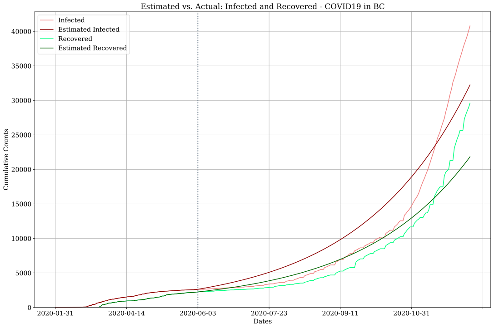


### SIR HP Tuning: August 1st - 100% of Population
Using 100% of the population and a later starting date:


```python
starting_date = "2020-08-01"
starting_index = bc_19[bc_19["date"] == starting_date].index[0]

bc_19 = bc_19_orig
projection_length = 0
susceptible_starting = 5110917

susceptible = np.ones((bc_19.shape[0],))*susceptible_starting - (bc_19["infected"] + bc_19["recovered"] + bc_19["dead"])

bc_19["susceptible"] = susceptible

bc_19_indexed = create_estimates(bc_19, 0)

# for b in range(round(0.028*b_reround), round(0.03*b_reround), round(0.0005*b_reround)):
#     b = b/b_reround
#     b = b/susceptible_starting
#     for k in range(550000, 65000, 50):    
#         k = k/susceptible_starting
#         bc_19_indexed, loss = estimate(bc_19_indexed, b, k)
#         res = {"b (*ss)": round(b*susceptible_starting, 3), "k (*ss)": round(k*susceptible_starting, 3), "loss": loss}
#         if min_loss == None or loss < min_loss:
#             min_loss = loss
#             best_est = res
#         estimates.append(res)

best_est = {'b (*ss)': 0.029, 'k (*ss)': 59900.0, 'loss': 2551653.792737399}
print(best_est)

# best estimates:
# {'b (*ss)': 0.022, 'k (*ss)': 35550.0, 'loss': 9537297.732304351}
# {'b (*ss)': 0.026, 'k (*ss)': 38950.0, 'loss': 8608329.648204742}
# {'b (*ss)': 0.026, 'k (*ss)': 42950.0, 'loss': 6535777.849462617}
# {'b (*ss)': 0.028, 'k (*ss)': 49950.0, 'loss': 4037073.2188167633}
# {'b (*ss)': 0.029, 'k (*ss)': 54950.0, 'loss': 3039015.8719697017}
# {'b (*ss)': 0.029, 'k (*ss)': 59900.0, 'loss': 2551653.792737399}
```

    {'b (*ss)': 0.029, 'k (*ss)': 59900.0, 'loss': 2551653.792737399}
    


```python
print(best_est)
bc_19_indexed = create_estimates(bc_19, 0)
bc_19_indexed, loss = estimate(bc_19_indexed, best_est["b (*ss)"]/susceptible_starting, best_est["k (*ss)"]/susceptible_starting)
plot_estimates(bc_19_indexed)
```

    {'b (*ss)': 0.029, 'k (*ss)': 59900.0, 'loss': 2551653.792737399}
    


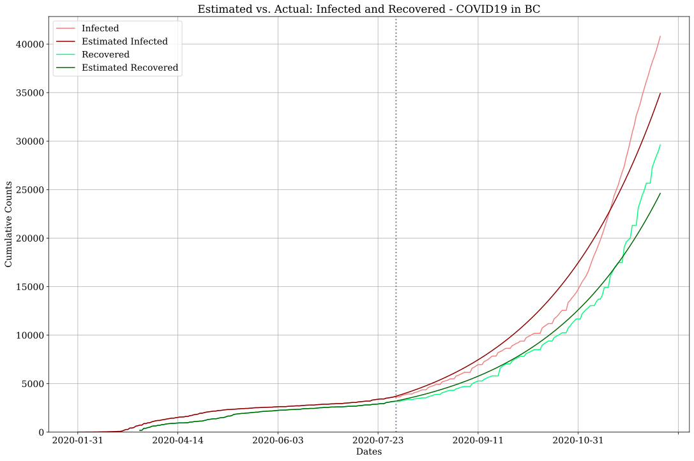


### SIR HP Tuning: Most Likely
```{'b (*ss)': 0.03, 'k (*ss)': 59900.0}```


```python
most_likely = {'b (*ss)': 0.03, 'k (*ss)': 59900.0, 'loss': 2551653.792737399}

bc_19_indexed = create_estimates(bc_19, 0)
bc_19_indexed, loss = estimate(bc_19_indexed, most_likely["b (*ss)"]/susceptible_starting, most_likely["k (*ss)"]/susceptible_starting)
plot_estimates(bc_19_indexed, "Most Likely - Estimated vs. Actual: Infected and Recovered")
```


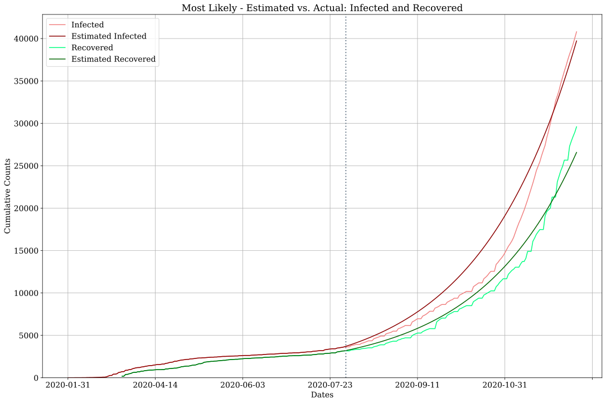


### SIR HP Tuning: Worst-Case
```{'b (*ss)': 0.033, 'k (*ss)': 59900.0}```


```python
worst_case = {'b (*ss)': 0.033, 'k (*ss)': 59900.0}

bc_19_indexed = create_estimates(bc_19, 0)
bc_19_indexed, loss = estimate(bc_19_indexed, worst_case["b (*ss)"]/susceptible_starting, worst_case["k (*ss)"]/susceptible_starting)
plot_estimates(bc_19_indexed,  "Worst Case - Estimated vs. Actual: Infected and Recovered")
```


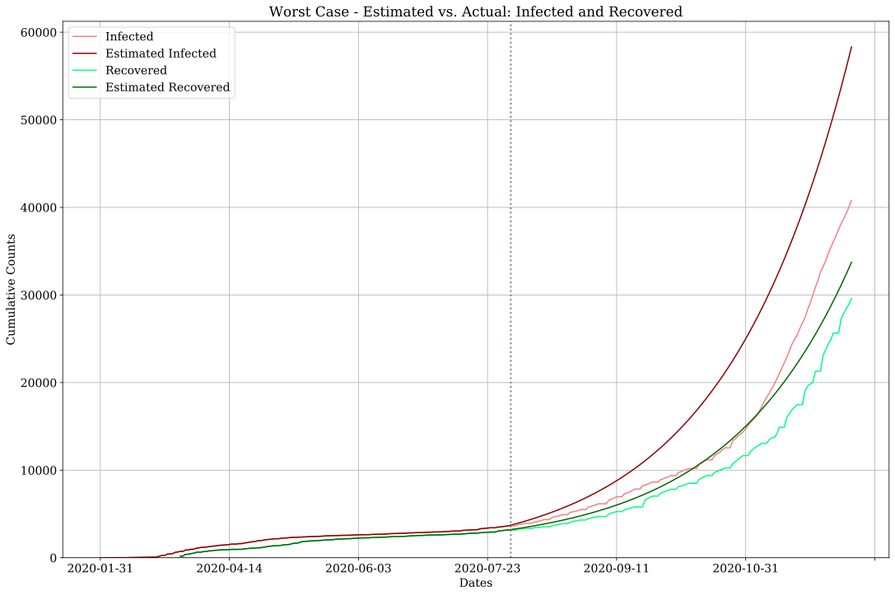


### SIR HP Tuning: Best-Case
```{'b (*ss)': 0.026, 'k (*ss)': 59900.0}```


```python
best_case = {'b (*ss)': 0.026, 'k (*ss)': 59900.0}

bc_19_indexed = create_estimates(bc_19, 0)
bc_19_indexed, loss = estimate(bc_19_indexed, best_case["b (*ss)"]/susceptible_starting, best_case["k (*ss)"]/susceptible_starting)
plot_estimates(bc_19_indexed,  "Best Case - Estimated vs. Actual: Infected and Recovered")
```


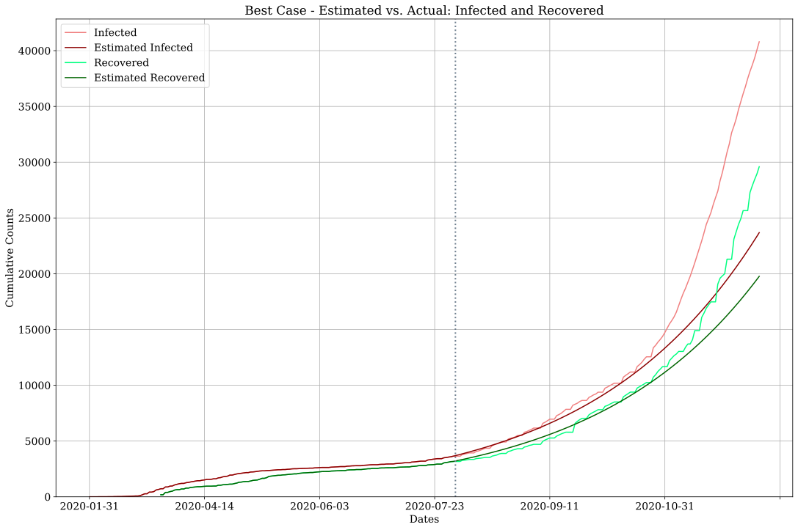


```python
def plot_sir():
    visualization_arr = ["susceptible", "susceptible_est", "infected", "infected_est", "recovered", "recovered_est"]
    colors = ["wheat", "darkorange", "lightcoral", "darkred", "springgreen", "darkgreen"]
    ax = bc_19_indexed[visualization_arr].plot(figsize=(18, 12), color=colors)
    font = {'font.family' : 'serif',
            'font.size'   : 14,
            'font.weight' : 'normal'}

    plt.rcParams.update(font)
    plt.title("COVID-19 Infected, Recovered, and Dead in BC")
    plt.xlabel("Dates")
    plt.ylabel("Cumulative Counts")
    plt.ylim(bottom=0)
    plt.legend()
    plt.grid(True)

    ax.legend(["Susceptible", "Estimated Susceptible", "Infected", "Estimated Infected", "Recovered", "Estimated Recovered"])

```


```python
bc_19 = bc_19_orig

best_case =  {'b (*ss)': 0.026, 'k (*ss)': 59900.0}
most_likely = {'b (*ss)': 0.03, 'k (*ss)': 59900.0}
worst_case = {'b (*ss)': 0.033, 'k (*ss)': 59900.0}


projection_length = 60

bc_19_indexed = create_estimates(bc_19, projection_length)
best_index, loss = estimate(bc_19_indexed, best_case["b (*ss)"]/susceptible_starting, best_case["k (*ss)"]/susceptible_starting)

bc_19_indexed = create_estimates(bc_19, projection_length)
likely_index, loss = estimate(bc_19_indexed, most_likely["b (*ss)"]/susceptible_starting, most_likely["k (*ss)"]/susceptible_starting)

bc_19_indexed = create_estimates(bc_19, projection_length)
worst_index, loss = estimate(bc_19_indexed, worst_case["b (*ss)"]/susceptible_starting, worst_case["k (*ss)"]/susceptible_starting)
```

## SIR Projection Visualization: Two-Month Worst, Likely, and Best-Case Infected Predictions in BC


```python
visualization_arr = ["infected"]

plt.figure(figsize=(18, 12))

best_color = "lightcoral"
likely_color = "red"
worst_color = "darkred"

bc_19 = bc_19_indexed.reset_index()

a_thousand = 1000

plt.plot(bc_19["date"], best_index["infected_est"]/a_thousand, color=best_color)
plt.plot(bc_19["date"], likely_index["infected_est"]/a_thousand, color=likely_color)
plt.plot(bc_19["date"], worst_index["infected_est"]/a_thousand, color=worst_color)

plt.plot(bc_19["date"], bc_19_indexed["infected"]/a_thousand, marker='o', linestyle='None', color="firebrick", markersize=0.8)

ax = plt.gca()
ax.set_xticks(np.arange(bc_19.shape[0], step=100))

ax.yaxis.set_major_formatter(FormatStrFormatter("%.1fk"))

ax.fill_between(bc_19["date"], best_index["infected_est"]/a_thousand, worst_index["infected_est"]/a_thousand, facecolor='darkslategray', alpha=0.1)

plt.grid(True)

projection_starting_date = "2020-08-01"
ax.axvline(x=bc_19[bc_19["date"] == projection_starting_date].index, color="slategray", linestyle=":", linewidth=2)

ax.legend(["Infected Best-Case", "Infected Most-Likely", "Infected Worst-Case", "Infected Data", "Projection Starting Date"])

plt.title("Two-Month Worst, Likely, and Best-Case Infected Predictions in BC - SIR Model Implementation")
plt.xlabel("Dates")
plt.ylabel("Cumulative Counts (Thousands)")
plt.show()
```


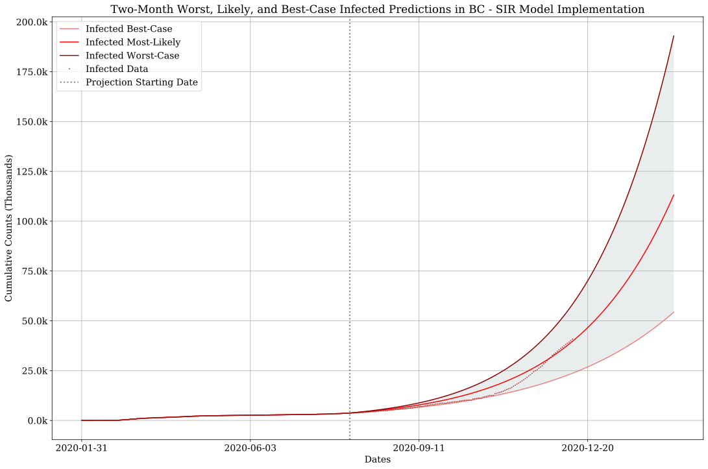


```python
bc_19 = bc_19_orig

best_case =  {'b (*ss)': 0.026, 'k (*ss)': 59900.0}
most_likely = {'b (*ss)': 0.03, 'k (*ss)': 59900.0}
worst_case = {'b (*ss)': 0.033, 'k (*ss)': 59900.0}


projection_length = 1000

bc_19_indexed = create_estimates(bc_19, projection_length)
best_index, loss = estimate(bc_19_indexed, best_case["b (*ss)"]/susceptible_starting, best_case["k (*ss)"]/susceptible_starting)

bc_19_indexed = create_estimates(bc_19, projection_length)
likely_index, loss = estimate(bc_19_indexed, most_likely["b (*ss)"]/susceptible_starting, most_likely["k (*ss)"]/susceptible_starting)

bc_19_indexed = create_estimates(bc_19, projection_length)
worst_index, loss = estimate(bc_19_indexed, worst_case["b (*ss)"]/susceptible_starting, worst_case["k (*ss)"]/susceptible_starting)
```

## SIR Projection Visualization: Long-Term Worst, Likely, and Best-Case SIR Model Predictions in BC


```python
visualization_arr = ["susceptible", "susceptible_est", "infected", "infected_est", "recovered", "recovered_est"]
estimate_arr = ["susceptible_est", "infected_est", "recovered_est"]

plt.figure(figsize=(18, 12))

best_colors = ["bisque", "lightcoral", "lightgreen"]
likely_colors = ["orange", "red", "green"]
worst_colors = ["chocolate", "darkred", "darkgreen"]

bc_19 = bc_19_indexed.reset_index()

a_million = 1000000

for i in range(len(estimate_arr)):
    plt.plot(bc_19["date"], best_index[estimate_arr[i]]/a_million, color=best_colors[i])
    plt.plot(bc_19["date"], likely_index[estimate_arr[i]]/a_million, color=likely_colors[i])
    plt.plot(bc_19["date"], worst_index[estimate_arr[i]]/a_million, color=worst_colors[i])


ax = plt.gca()
ax.set_xticks(np.arange(bc_19.shape[0], step=129))
ax.set_yticks(np.arange(5.5, step=0.5))

ax.yaxis.set_major_formatter(FormatStrFormatter("%.1fM"))

ax.axvline(x=bc_19[bc_19["date"] == projection_starting_date].index, color="slategray", linestyle=":", linewidth=2)

ax.legend(["Susceptible Best-Case", "Susceptible Most-Likely", "Susceptible Worst-Case", "Infected Best-Case", "Infected Most-Likely", "Infected Worst-Case", "Recovered Best-Case", "Recovered Most-Likely", "Recovered Worst-Case", "Projection Starting Date"])

plt.grid(True)

plt.title("Long-Term Worst, Likely, and Best-Case SIR Model Predictions in BC")
plt.xlabel("Dates")
plt.ylabel("Cumulative Counts (Millions)")
plt.show()
```


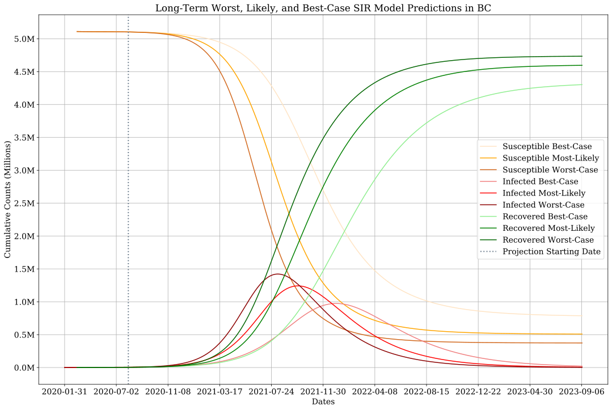


## Model Discussion
Now that we have implemented the model and presented both short and long term predictions for the best, worst, and most-likely outcomes based on the SIR equations, we will now discuss the effectiveness of the model.

As mentioned before, there is a lot missing from the current implementation of the model. Many of the assumptions do not make sense given the nature of COVID-19. We assume that the population is constant, that everyone in the population is susceptible, and that the virus does not mutate. All three of these assumptions are inaccurate in one way or another. Given that new babies are being born every day, the population is not constant. Furthermore, inter-provincial travel is possible so a susceptible/infected individual could travel to another province and our model would not take this into account. Moreover, there are many people that are not susceptible to the virus due to self-isolation, the accessibility of where they live, the antibodies that they may have acquired, or other unforseeable reasons. Lastly, researchers have found that COVID-19 has mutated and will likely continue to mutate as more people get infected (https://www.nature.com/articles/d41586-020-02544-6). 

We also did not take into account the number of people that died due to the virus. While the fatality rate of the virus is low, especially for people in good health under 70, this assumption is also unfair. The final assumption that we made was that a vaccine did not exist. This assumption also does not make sense given the recent Pfizer vaccine. 

# Advanced SIR Model
As such, we will implement a more intelligent modified SIR model. The equations for our previous SIR model are:

$\frac{ds}{dt} = -b s(t) i(t)$

$\frac{di}{dt} = -k i(t) + b s(t) i(t)$

$\frac{dr}{dt} = k i(t)$

Our new model takes into account the natural birth and death rate, $\mu$, of the population. It also takes into account the virus induced death rate, $\alpha$. The rate at which BC residents are vaccinated, assuming that the Pfizer vaccine is distributed linearly, was also taken into account using the $c$ constant. 

Our new model also has a novel feature that most SIR models don't include. The death rate of our model increases exponentially based on how many people are infected. This makes sense because as the number of infected people increases, so does the number of people that need intensive care. As the number of people that need intensive care passes the capacity of the hospitals in BC, the death rate will inevitably spike. This effect is taken into account using the $h$ constant present in the infected and dead equations. 

$\frac{ds}{dt} = -b s(t) i(t) + \mu (s(t) + i(t) + r(t)) - \mu s(t) - c$

$\frac{di}{dt} = -k i(t) + b s(t) i(t) - \mu i(t) - \alpha i(t) - h i(t)^2$ 

$\frac{dr}{dt} = k i(t)$

The Euler equations for these differential equations are:

$s_i = s_{i-1} + (-b \hspace{0.5mm} s_{i-1} i_{i-1} + \mu \hspace{0.5mm} (s_{i-1} + i_{i-1} + r_{i-1}) - \mu \hspace{0.5mm} s_{i-1} - c) \cdot \Delta t$  
$i_i = i_{i-1} + (- k i_{i-1} + b \hspace{0.5mm} s_{i-1} i_{i-1} - \mu \hspace{0.5mm} i_{i-1} - \alpha \hspace{0.5mm} i_{i-1}) \cdot \Delta t$  
$r_i = r_{i-1} + k \hspace{0.5mm} i_{i-1} \cdot \Delta t$

Given these updated Euler equations, we must create new SIR model update equations. We will also consider the number of people that died as a result of the virus. This can be modelled using the following differential equation and Euler update equation:

$\frac{dd}{dt} = \alpha \hspace{0.5mm} i(t) + h \hspace{0.5mm} i(t)^2$  

$d_i = d_{i-1} + (\alpha \hspace{0.5mm} i_{i-1} + h \hspace{0.5mm} i(t)^2)* \Delta t$


```python
def adv_s_update(s_prev, i_prev, r_prev, d_prev, b, k, a, u, c, h, dt=1):
    return s_prev + (-b * s_prev * i_prev + u * (s_prev + i_prev + r_prev) - u * s_prev - c)* dt

def adv_i_update(s_prev, i_prev, r_prev, d_prev, b, k, a, u, c, h, dt=1):
    return i_prev + (-k * i_prev + b * s_prev * i_prev - u * i_prev - a * i_prev - h * i_prev * i_prev) * dt

def adv_r_update(s_prev, i_prev, r_prev, d_prev, b, k, a, u, c, h, dt=1):
    return r_prev + k * i_prev * dt

def adv_d_update(s_prev, i_prev, r_prev, d_prev, b, k, a, u, c, h, dt=1):
    return d_prev + (a * i_prev + h * i_prev * i_prev) * dt

def mse_loss(actual, predictions):
    return ((actual - predictions)**2).mean(axis=0)

def adv_estimate(bc_19, starting_index, b, k, a, u, c, h):
    for i in range(starting_index, bc_19.shape[0]):
        bc_19["susceptible_est"][i] = adv_s_update(bc_19["susceptible_est"][i-1], bc_19["infected_est"][i-1], bc_19["recovered_est"][i-1], bc_19["dead_est"][i-1], b, k, a, u, c, h)
        bc_19["infected_est"][i] = adv_i_update(bc_19["susceptible_est"][i-1], bc_19["infected_est"][i-1], bc_19["recovered_est"][i-1], bc_19["dead_est"][i-1], b, k, a, u, c, h)
        bc_19["recovered_est"][i] = adv_r_update(bc_19["susceptible_est"][i-1], bc_19["infected_est"][i-1], bc_19["recovered_est"][i-1], bc_19["dead_est"][i-1], b, k, a, u, c, h)
        bc_19["dead_est"][i] = adv_d_update(bc_19["susceptible_est"][i-1], bc_19["infected_est"][i-1], bc_19["recovered_est"][i-1], bc_19["dead_est"][i-1], b, k, a, u, c, h)

    return bc_19, mse_loss(bc_19["infected"], bc_19["infected_est"]) + mse_loss(bc_19["recovered"], bc_19["recovered_est"])

def create_estimates(bc_19, starting_index, projection_length):
    cur_datetime = datetime.date.fromisoformat("2020-12-11") + datetime.timedelta(days=1)

    for i in range(projection_length):
        bc_19 = bc_19.append({"date": datetime.date.isoformat(cur_datetime)}, ignore_index=True)
        cur_datetime += datetime.timedelta(days=1)

    bc_19_indexed = bc_19.set_index("date")

    est_s = np.zeros((bc_19_indexed.shape[0],))
    est_i = np.zeros((bc_19_indexed.shape[0],))
    est_r = np.zeros((bc_19_indexed.shape[0],))
    est_d = np.zeros((bc_19_indexed.shape[0],))


    est_s[starting_index] = bc_19["susceptible"][starting_index]
    est_s[:starting_index] = bc_19["susceptible"][:starting_index]

    est_i[starting_index] = bc_19["infected"][starting_index]
    est_i[:starting_index] = bc_19["infected"][:starting_index]

    est_r[starting_index] = bc_19["recovered"][starting_index] 
    est_r[:starting_index] = bc_19["recovered"][:starting_index]

    est_d[starting_index] = bc_19["dead"][starting_index] 
    est_d[:starting_index] = bc_19["dead"][:starting_index]

    bc_19_indexed["susceptible_est"] = est_s
    bc_19_indexed["infected_est"] = est_i
    bc_19_indexed["recovered_est"] = est_r
    bc_19_indexed["dead_est"] = est_d

    return bc_19_indexed

def plot_estimates(bc_19_indexed, starting_index, title="Estimated vs. Actual: Infected, Recovered, Dead - COVID19 in BC"):
    visualization_arr = ["infected", "infected_est", "recovered", "recovered_est", "dead", "dead_est"]
    colors = ["lightcoral", "darkred", "springgreen", "darkgreen", "gray", "black"]
    ax = bc_19_indexed[visualization_arr].plot(figsize=(18, 12), color=colors)
    font = {'font.family' : 'serif',
            'font.size'   : 14,
            'font.weight' : 'normal'}

    bc_19 = bc_19_indexed.reset_index()
    
    ax.axvline(x=starting_index, color="slategray", linestyle=":", linewidth=2)


    plt.rcParams.update(font)
    plt.title(title)
    plt.xlabel("Dates")
    plt.ylabel("Cumulative Counts")
    plt.ylim(bottom=0)
    plt.legend()
    plt.grid(True)

    ax.legend(["Infected", "Estimated Infected", "Recovered", "Estimated Recovered", "Dead", "Estimated Dead", "Projection Start Date"])

    plt.show()
```

# Advanced SIR Model Estimated vs. Actual: Infected and Recovered


```python
bc_19 = bc_19_orig

susceptible_starting = 5110917
good_b_guess = 0.03/susceptible_starting
good_k_guess = 59900/susceptible_starting
good_a_guess = 1200/susceptible_starting
good_u_guess = 5/susceptible_starting
good_c_guess = 400000/susceptible_starting
good_h_guess = 0.01/susceptible_starting
projection_length = 0

starting_date = "2020-08-01"
starting_index = bc_19[bc_19["date"] == starting_date].index[0]

bc_19_indexed = create_estimates(bc_19, starting_index, 0)

bc_19_indexed, loss = adv_estimate(bc_19_indexed, starting_index, good_b_guess, good_k_guess, good_a_guess, good_u_guess, good_c_guess, good_h_guess)
plot_estimates(bc_19_indexed, starting_index, "Advanced SIR Model - Estimated vs. Actual: Infected and Recovered")
```


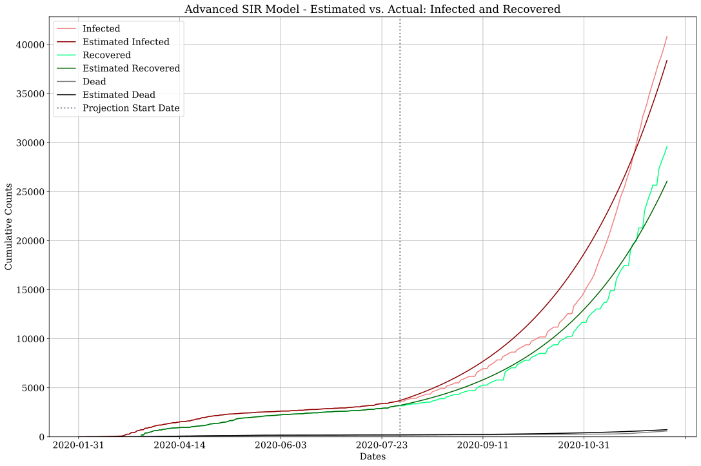


# Advanced SIR Model: Short-Term Predictions


```python
bc_19 = bc_19_orig

best_case =  {'b (*ss)': 0.026, 'k (*ss)': 59900.0}
most_likely = {'b (*ss)': 0.03, 'k (*ss)': 59900.0}
worst_case = {'b (*ss)': 0.033, 'k (*ss)': 59900.0}

good_b_guess = 0.03/susceptible_starting
good_k_guess = 59900/susceptible_starting
good_a_guess = 1200/susceptible_starting
good_u_guess = 5/susceptible_starting
good_c_guess = 900000/susceptible_starting
good_h_guess = 0.01/susceptible_starting

projection_length = 60

starting_date = "2020-08-01"
starting_index = bc_19[bc_19["date"] == starting_date].index[0]

bc_19_indexed = create_estimates(bc_19, starting_index, projection_length)
best_index, loss = adv_estimate(bc_19_indexed, starting_index, best_case["b (*ss)"]/susceptible_starting, best_case["k (*ss)"]/susceptible_starting, good_a_guess, good_u_guess, good_c_guess, good_h_guess)

bc_19_indexed = create_estimates(bc_19, starting_index, projection_length)
likely_index, loss = adv_estimate(bc_19_indexed, starting_index, most_likely["b (*ss)"]/susceptible_starting, most_likely["k (*ss)"]/susceptible_starting, good_a_guess, good_u_guess, good_c_guess, good_h_guess)

bc_19_indexed = create_estimates(bc_19, starting_index, projection_length)
worst_index, loss = adv_estimate(bc_19_indexed, starting_index, worst_case["b (*ss)"]/susceptible_starting, worst_case["k (*ss)"]/susceptible_starting, good_a_guess, good_u_guess, good_c_guess, good_h_guess)
```


```python
visualization_arr = ["infected"]

plt.figure(figsize=(18, 12))

best_color = "lightcoral"
likely_color = "red"
worst_color = "darkred"

bc_19 = bc_19_indexed.reset_index()

a_thousand = 1000

plt.plot(bc_19["date"], best_index["infected_est"]/a_thousand, color=best_color)
plt.plot(bc_19["date"], likely_index["infected_est"]/a_thousand, color=likely_color)
plt.plot(bc_19["date"], worst_index["infected_est"]/a_thousand, color=worst_color)

plt.plot(bc_19["date"], bc_19_indexed["infected"]/a_thousand, marker='o', linestyle='None', color="firebrick", markersize=0.8)

ax = plt.gca()
ax.set_xticks(np.arange(bc_19.shape[0], step=100))

ax.yaxis.set_major_formatter(FormatStrFormatter("%.1fk"))

ax.fill_between(bc_19["date"], best_index["infected_est"]/a_thousand, worst_index["infected_est"]/a_thousand, facecolor='darkslategray', alpha=0.1)

plt.grid(True)

ax.axvline(x=starting_index, color="slategray", linestyle=":", linewidth=2)

ax.legend(["Infected Best-Case", "Infected Most-Likely", "Infected Worst-Case", "Infected Data", "Projection Starting Date"])

plt.title("Two-Month Worst, Likely, and Best-Case Infected Predictions in BC - Advanced SIR Model Implementation")
plt.xlabel("Dates")
plt.ylabel("Cumulative Counts (Thousands)")
plt.show()
```


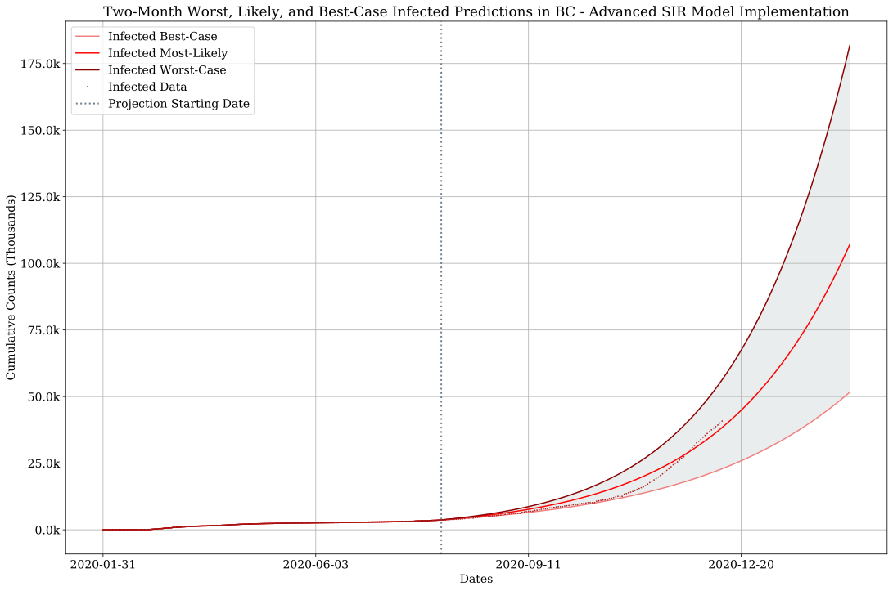


# Long-Term Advanced SIR Model Predictions
The main novel aspect of this model is the variable death rate that depends on the square of the number of infected people. This variable death rate was designed to take into account the fact that as the number of infected people grows, the death rate also grows because hospitals have a fixed capacity. Infected persons that require intensive care but are not afforded it die. That is a reality. The graph below illustrates the advanced SIR model predictions using the parameters that most accurately fit the data. 


```python
bc_19 = bc_19_orig

projection_length = 1000


starting_date = "2020-08-01"
starting_index = bc_19[bc_19["date"] == starting_date].index[0]

bc_19_indexed = create_estimates(bc_19, starting_index, projection_length)
bc_19_indexed, loss = adv_estimate(bc_19_indexed, starting_index, good_b_guess, good_k_guess, good_a_guess, good_u_guess, good_c_guess, good_h_guess)

estimate_arr = ["susceptible_est", "infected_est", "recovered_est", "dead_est"]

plt.figure(figsize=(18, 12))

colors = ["orange", "red", "green", "black"]

bc_19 = bc_19_indexed.reset_index()

a_million = 1000000

for i in range(len(estimate_arr)):
    plt.plot(bc_19["date"], bc_19_indexed[estimate_arr[i]]/a_million, color=colors[i])

total_dead = bc_19["dead_est"].iloc[-1]


ax = plt.gca()
ax.set_xticks(np.arange(bc_19.shape[0], step=129))
ax.set_yticks(np.arange(5.5, step=0.5))

ax.yaxis.set_major_formatter(FormatStrFormatter("%.1fM"))

bc_19 = bc_19_orig

projection_length = 1000

dead_reest = create_estimates(bc_19, starting_index, projection_length)
dead_reest, loss = adv_estimate(bc_19_indexed, starting_index, good_b_guess, good_k_guess, good_a_guess, good_u_guess, good_c_guess, 0)

bc_19 = dead_reest.reset_index()


plt.plot(bc_19["date"], dead_reest["dead_est"]/a_million, color="gray")

ax.axvline(x=starting_index, color="slategray", linestyle=":", linewidth=2)
ax.axhline(y=total_dead/a_million, color="black", linestyle="dashed", linewidth=2)

ax.legend(["Susceptible Estimate", "Infected Estimate", "Recovered Estimate", "Dead Estimate", "Dead Estimate (Without h Term)", "Projection Start Date", "Total Dead = {}".format(round(total_dead))])

plt.grid(True)

plt.title("Long-Term Advanced SIR Model Predictions")
plt.xlabel("Dates")
plt.ylabel("Cumulative Counts (Millions)")
plt.show()
```


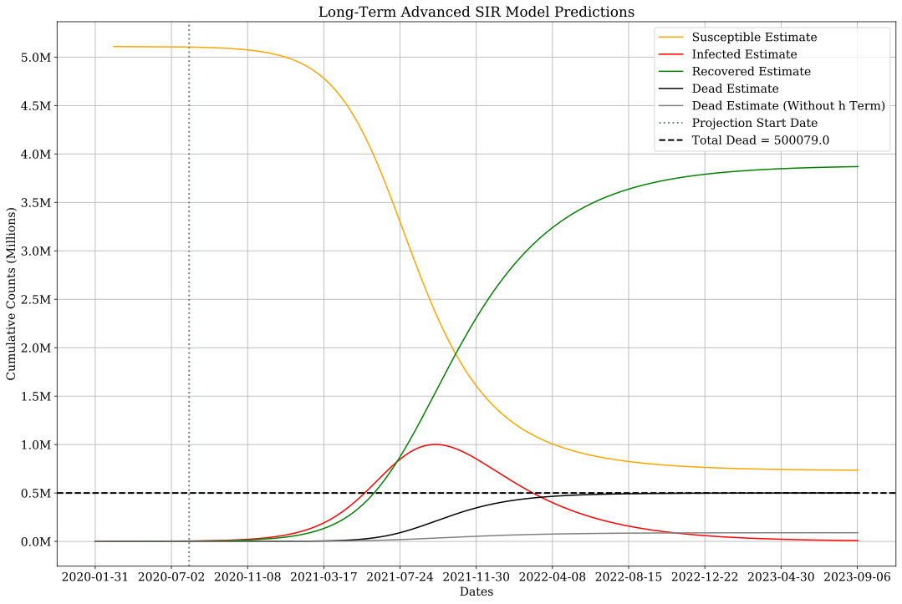


Notice that two death rates were plotted: a death rate with the $h$ term and a death rate without the $h$ term. The death rate with the $h$ term (in black) delineates the fatality rate assuming the hospitals cannot provide the care needed by those with severe COVID cases. The death rate without the $h$ term is the death rate that has been observed so far (because the hospitals have not reached full capacity yet).

The gap between the black and gray lines illustrate the lives that will be saved over the next couple years if we manage to slow the virus down so that the hospitals do not become over-populated. The following Figure illustrates the effect of reducing the contagiousness factor, $b$, to 70% of its current value:


```python
bc_19 = bc_19_orig

projection_length = 1000

starting_date = "2020-08-01"
starting_index = bc_19[bc_19["date"] == starting_date].index[0]

bc_19_indexed = create_estimates(bc_19, starting_index, projection_length)
bc_19_indexed, loss = adv_estimate(bc_19_indexed, starting_index, good_b_guess*0.7, good_k_guess, good_a_guess, good_u_guess, good_c_guess, good_h_guess)

estimate_arr = ["susceptible_est", "infected_est", "recovered_est", "dead_est"]

plt.figure(figsize=(18, 12))

colors = ["orange", "red", "green", "black"]

bc_19 = bc_19_indexed.reset_index()

a_million = 1000000

for i in range(len(estimate_arr)):
    plt.plot(bc_19["date"], bc_19_indexed[estimate_arr[i]]/a_million, color=colors[i])

total_dead = bc_19["dead_est"].iloc[-1]

ax = plt.gca()
ax.set_xticks(np.arange(bc_19.shape[0], step=180))
ax.set_yticks(np.arange(5.5, step=0.5))

ax.yaxis.set_major_formatter(FormatStrFormatter("%.1fM"))


ax.axvline(x=starting_index, color="slategray", linestyle=":", linewidth=2)
ax.axhline(y=total_dead/a_million, color="black", linestyle="dashed", linewidth=2)

ax.legend(["Susceptible Estimate", "Infected Estimate", "Recovered Estimate", "Dead Estimate", "Projection Start Date", "Total Dead = {}".format(round(total_dead))])

plt.grid(True)

plt.title("Long-Term Advanced SIR Model Predictions - 0.7 Transmission Factor")
plt.xlabel("Dates")
plt.ylabel("Cumulative Counts (Millions)")
plt.show()
```


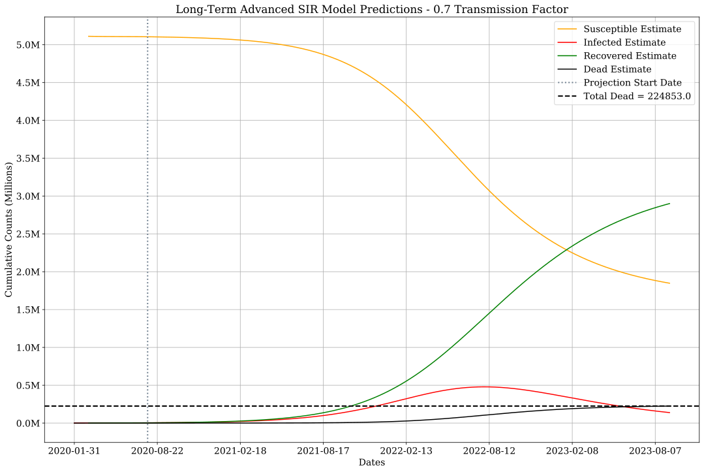


As illustrated by the above plots, by reducing the contagiousness factor, we can mitigate the damage that will be done by the virus. In the first plot, we can see that there are 500,000 deaths by September of 2023. In the second plot we can see that by reducing the contagiousness factor to 70% of its value, there are only 225,000 deaths. 

Clearly, by reducing the transmission rate of the virus we can save lives. Analyzing the factors that affect the transmission rate will be the focus of the next section. Using information regarding the policies implemented in BC, we will visualize the effect of these policies by considering them in conjunction with the infected case counts. 

# Investigating Supression Techniques
## Additional Dataset Analysis Options
There are a few factors that we could analyze for this part. We could quanitfy the effectiveness of policy policing in BC using data from the "Policing the Pandemic Mapping Project":


```python
# ppmp data: https://dataverse.scholarsportal.info/dataset.xhtml?persistentId=doi:10.5683/SP2/KNJLWS
# tracking the policing of COVID-19 across canada
ppmp = pd.read_csv("../data/ppmp/ppmp_data-1.csv")
print(ppmp.shape, "\n\n")
print(ppmp.head(), "\n\n")
print(ppmp.tail(), "\n\n")
print(ppmp.columns)
```

    (641, 18) 
    
    
                                 place province      lat     long  \
    0               hamilton, ontario        on  43.2557 -79.8711   
    1              quebec city, quebec       qc  46.8139 -71.2080   
    2      corner brook, newfoundland        nf  48.9490 -57.9503   
    3  rothesay, new brunswick, canada       nb  45.3765 -65.9915   
    4                 ottawa, ontario        on  45.4215 -75.6972   
    
                                               violation  \
    0                            non-essential business    
    1  disobeying 14-day self-isolation quarantine or...   
    2  disobeyed mandatory 14-day quarantine imposed ...   
    3   coughing on people after failing to self-isolate   
    4  spitting at police and claiming to have covid-...   
    
                                                sanction fine_certainty  \
    0                                          $750 fine            yes   
    1                                             arrest             no   
    2  arrest, one night in jail,  fine of betweenê$5...            yes   
    3                                           assault              no   
    4                                            assault             no   
    
       fine_value  number_of_charges_or_violations  number_of_people  \
    0       880.0                                1                 1   
    1         NaN                                1                 1   
    2       500.0                                1                 1   
    3         NaN                                2                 2   
    4         NaN                                1                 1   
    
      individual_business report_month                            acting_agency  \
    0            business          mar                  hamilton police service   
    1          individual          mar  service de police de la ville de quebec   
    2          individual          mar          royal newfoundland constabulary   
    3          individual          mar       kennebecasis regional police force   
    4          individual          mar                    ottawa police service   
    
                           legislation                 known_demographic  \
    0         emergency management act  shisha kaif cafe,  hookah lounge   
    1                public health act                             woman   
    2  public health and promotion act                             woman   
    3                    criminal code                           two men   
    4                    criminal code                               man   
    
                                              event_desc  \
    0  covid-19: hamilton police arrest alleged drug ...   
    1  a woman who tested positive for covid-19 was a...   
    2  n.l. woman arrested for refusing to self-isola...   
    3  two new brunswick men charged with assault for...   
    4  assault charges laid after man spit on ottawa ...   
    
                                               event_url other_event_url  
    0  https://nationalpost.com/news/covid-19-hamilto...             NaN  
    1  https://montreal.ctvnews.ca/mobile/a-woman-who...             NaN  
    2  https://atlantic.ctvnews.ca/n-l-woman-arrested...             NaN  
    3  https://beta.ctvnews.ca/local/atlantic/2020/3/...             NaN  
    4  https://www.ottawamatters.com/police-beat/assa...             NaN   
    
    
                             place province      lat      long  \
    636  corman park, saskatchewan       sk  52.2536 -106.9426   
    637             alban, ontario       on  46.0362  -80.5373   
    638           windsor, ontario       on  42.3149  -83.0364   
    639         winnipeg, manitoba       mb  49.8951  -97.1384   
    640       regina, saskatchewan       sk  50.4452 -104.6189   
    
                                        violation      sanction fine_certainty  \
    636          gathering of more than 15 people   $2,800 fine            yes   
    637                     failure to quarantine   $1,255 fine            yes   
    638                       face mask violation         $750             yes   
    639  3 businesses violated new covid-19 rules  $ 5,000 fine            yes   
    640          gathering of more than 15 people   $2,800 fine            yes   
    
         fine_value  number_of_charges_or_violations  number_of_people  \
    636      2800.0                                1                 1   
    637      1255.0                                1                 1   
    638       750.0                                1                 1   
    639      5000.0                                3                 3   
    640      2800.0                                1                 1   
    
        individual_business             report_month  \
    636          individual       corman park police   
    637          individual       nipissing west opp   
    638            business   windsor police service   
    639            business  winnipeg police service   
    640          individual    regina police service   
    
                                         acting_agency                legislation  \
    636                              public health act  public health law offence   
    637                         federal quarantine act  public health law offence   
    638  emergency management and civil protection act      emergency law offence   
    639                         emergency measures act      emergency law offence   
    640                              public health act  public health law offence   
    
        known_demographic                                         event_desc  \
    636     not specified          fine received for hosting large gathering   
    637     not specified  resident charged with failing to quarantine af...   
    638     not specified  windsor food supply business fined for face ma...   
    639     not specified  three winnipeg businesses fined $5k for breaki...   
    640     not specified  regina woman fined $2,800 for public health or...   
    
                                                 event_url other_event_url  
    636  https://globalnews.ca/news/7439085/corman-park...             NaN  
    637  https://globalnews.ca/news/7442168/coronavirus...             NaN  
    638  https://windsor.ctvnews.ca/windsor-food-supply...             NaN  
    639  https://winnipeg.ctvnews.ca/three-winnipeg-bus...             NaN  
    640  https://globalnews.ca/news/7445719/house-party...             NaN   
    
    
    Index(['place', 'province', 'lat', 'long', 'violation', 'sanction',
           'fine_certainty', 'fine_value', 'number_of_charges_or_violations',
           'number_of_people', 'individual_business', 'report_month',
           'acting_agency', 'legislation', 'known_demographic', 'event_desc',
           'event_url', 'other_event_url'],
          dtype='object')
    

We could also use the testing data in each region in BC to determine how correlated the testing frequency is with the infected count:


```python
# bc lab data: http://www.bccdc.ca/health-info/diseases-conditions/covid-19/data
# lab data that shows testing rate in each region in BC
bc_db_lab = pd.read_csv("../data/bc/BCCDC_COVID19_Dashboard_Lab_Information.csv")
print(bc_db_lab.shape, "\n\n")
print(bc_db_lab.head(), "\n\n")
print(bc_db_lab.tail(), "\n\n")
print(bc_db_lab.columns)
```

    (2254, 6) 
    
    
             Date    Region  New_Tests  Total_Tests  Positivity  Turn_Around
    0  2020-01-23        BC          2            2         0.0         32.0
    1  2020-01-23    Fraser          0            0         0.0          0.0
    2  2020-01-23  Interior          0            0         0.0          0.0
    3  2020-01-23  Northern          0            0         0.0          0.0
    4  2020-01-23   Unknown          0            0         0.0          0.0 
    
    
                Date             Region  New_Tests  Total_Tests  Positivity  \
    2249  2020-12-10           Interior       1335       130668        6.61   
    2250  2020-12-10           Northern        379        37621       10.34   
    2251  2020-12-10            Unknown         68        25639        0.00   
    2252  2020-12-10  Vancouver Coastal       2543       400235        4.44   
    2253  2020-12-10   Vancouver Island       1150       143159        0.99   
    
          Turn_Around  
    2249         23.9  
    2250         28.4  
    2251         53.1  
    2252         21.8  
    2253         13.0   
    
    
    Index(['Date', 'Region', 'New_Tests', 'Total_Tests', 'Positivity',
           'Turn_Around'],
          dtype='object')
    

We could also investigate the effects of non-pharmaceutical interventions taken by the BC government. Canadian intervention data is available here: http://covid19-interventions.com/ By extracting the BC data, we could analyze how the $b$ factor in our SIR model varied according to the policies that were implemented. 

Analyzing this factor makes the most sense because in order to recommend policies, it is important to investigate their effectiveness and the motives for their implementation. 

## Dataset Extraction Using Intervention Data: http://covid19-interventions.com/


```python
gb_events = pd.read_excel("../data/COVID19_non-pharmaceutical-interventions_version2_utf8.xlsx")
print(gb_events.shape, "\n\n")
print(gb_events.head(), "\n\n")
print(gb_events.tail(), "\n\n")
print(gb_events.columns)
```

    (8782, 13) 
    
    
       id  Country iso3    State   Region       Date  \
    0   1  Albania  ALB  Albania  Albania 2020-02-25   
    1   2  Albania  ALB  Albania  Albania 2020-02-25   
    2   3  Albania  ALB  Albania  Albania 2020-02-25   
    3   4  Albania  ALB  Albania  Albania 2020-02-25   
    4   5  Albania  ALB  Albania  Albania 2020-03-08   
    
                                              Measure_L1  \
    0                                 Risk communication   
    1                                Resource allocation   
    2              Healthcare and public health capacity   
    3  Case identification, contact tracing and relat...   
    4                                 Travel restriction   
    
                                             Measure_L2  \
    0  Educate and actively communicate with the public   
    1                           Crisis management plans   
    2           Adapt procedures for patient management   
    3                              Airport health check   
    4                               Airport restriction   
    
                                   Measure_L3  \
    0     Encourage self-initiated quarantine   
    1         Financial aid for health system   
    2             Implement triage procedures   
    3  Specific health channel for travellers   
    4   Cancellation of international flights   
    
                                              Measure_L4 Status  \
    0           Travelers returning from high risk areas    NaN   
    1              Funds to increase availability of PPE    NaN   
    2                                     Health hotline    NaN   
    3            National passengers arriving from China    NaN   
    4  Partial cancellation of international flights:...    NaN   
    
                                                 Comment  \
    0  "The head of the National Medical Emergency Ce...   
    1  "Albanian Ministry of Health and Social Protec...   
    2  He clarified that when people notice symptoms,...   
    3  " Albanian citizens arriving from China, Singa...   
    4  Government stopped all flights with quarantine...   
    
                                                  Source  
    0  https://balkaneu.com/albania-national-medical-...  
    1  https://balkaneu.com/albania-national-medical-...  
    2  https://balkaneu.com/albania-national-medical-...  
    3  https://balkaneu.com/albania-national-medical-...  
    4  https://tvklan.al/ndalohen-fluturimet-me-10-de...   
    
    
            id                   Country iso3    State   Region       Date  \
    8777  8778  United States of America  USA  Wyoming  Wyoming 2020-03-25   
    8778  8779  United States of America  USA  Wyoming  Wyoming 2020-03-30   
    8779  8780  United States of America  USA  Wyoming  Wyoming 2020-03-30   
    8780  8781  United States of America  USA  Wyoming  Wyoming 2020-04-03   
    8781  8782  United States of America  USA  Wyoming  Wyoming 2020-04-03   
    
                                                 Measure_L1  \
    8777                                  Social distancing   
    8778                                  Social distancing   
    8779                                 Risk communication   
    8780  Case identification, contact tracing and relat...   
    8781                                  Social distancing   
    
                                  Measure_L2                           Measure_L3  \
    8777        Indoor gathering restriction    Closure of close contact services   
    8778        Indoor gathering restriction    Closure of restaurants/bars/cafes   
    8779  Actively communicate with managers  Guidelines for shops and businesses   
    8780                          Quarantine                  Incoming travellers   
    8781        Indoor gathering restriction    Closure of restaurants/bars/cafes   
    
                                                 Measure_L4 Status  \
    8777                  Beauty and personal care services    NaN   
    8778  Partial: restaurants with liquor license can s...    NaN   
    8779                      For grocery and retail stores    NaN   
    8780                                                All    NaN   
    8781  Partial: restaurants with liquor license can s...    NaN   
    
                                                    Comment  \
    8777  closure of nail salons, hair salons, barber sh...   
    8778  Restaurant/Bar & Grill with liquor license all...   
    8779  Guidance for Grocery and Retail Stores from th...   
    8780  statewide directive for individuals arriving i...   
    8781  Restaurant/Bar & Grill Emergency Liquor Servic...   
    
                                                     Source  
    8777  https://health.wyo.gov/wp-content/uploads/2020...  
    8778  https://drive.google.com/file/d/1z_UrniG8E50dE...  
    8779  https://health.wyo.gov/wp-content/uploads/2020...  
    8780  https://drive.google.com/file/d/1xZF2MlVstWCSp...  
    8781  https://drive.google.com/file/d/1FD3iK1QCPkE6B...   
    
    
    Index(['id', 'Country', 'iso3', 'State', 'Region', 'Date', 'Measure_L1',
           'Measure_L2', 'Measure_L3', 'Measure_L4', 'Status', 'Comment',
           'Source'],
          dtype='object')
    


```python
canadian_events = gb_events[gb_events["Country"] == "Canada"]
bc_events = canadian_events[canadian_events["Region"] == "British Columbia"]
print(canadian_events["Measure_L1"].unique())
```

    ['Social distancing' 'Resource allocation' 'Travel restriction'
     'Case identification, contact tracing and related measures'
     'Risk communication' 'Healthcare and public health capacity'
     'Environmental measures']
    


```python
print(bc_events.shape, "\n\n")
print(bc_events.columns)
```

    (5, 13) 
    
    
    Index(['id', 'Country', 'iso3', 'State', 'Region', 'Date', 'Measure_L1',
           'Measure_L2', 'Measure_L3', 'Measure_L4', 'Status', 'Comment',
           'Source'],
          dtype='object')
    


```python
print(bc_events[["Date", "Measure_L1"]], "\n")

print(bc_events["Source"].iloc[0])
print(bc_events["Source"].iloc[1])
print(bc_events["Source"].iloc[2])
print(bc_events["Source"].iloc[3])
print(bc_events["Source"].iloc[4])
```

              Date           Measure_L1
    400 2020-03-18  Resource allocation
    401 2020-03-18   Travel restriction
    402 2020-03-18  Resource allocation
    403 2020-03-18    Social distancing
    404 2020-03-18    Social distancing 
    
    https://globalnews.ca/news/6697149/public-safety-minister-update-coronavirus/
    https://globalnews.ca/news/6697149/public-safety-minister-update-coronavirus/
    https://globalnews.ca/news/6697149/public-safety-minister-update-coronavirus/
    https://www.cbc.ca/news/canada/british-columbia/closures-st-pats-vancouver-venues-1.5500472
    https://www.cbc.ca/news/canada/british-columbia/closures-st-pats-vancouver-venues-1.5500472
    

From the above, we can see that only 5 events are available in the dataset. Notice that the data has been gathered from publically available news sources, namely, Global News and CBC. We will augment the dataset by adding additional events tracked by CBC so that our analysis is more meaningful. 


```python
def add_bc_event(bc_events, date, name, e_type, source="https://www.cbc.ca/news/canada/british-columbia/covid-19-bc-timeline-1.5520943"):
    return bc_events.append({"date":date, "name": name, "e_type": e_type, "source": source}, ignore_index=True)
```


```python
# possible "e_type" classifications:
# ['Social distancing' 'Resource allocation' 'Travel restriction'
#  'Case identification, contact tracing and related measures'
#  'Risk communication' 'Healthcare and public health capacity'
#  'Environmental measures']
```


```python
bc_events = canadian_events[canadian_events["Region"] == "British Columbia"]

bc_events = bc_events.rename(columns={"Date": "date", "Measure_L2": "name", "Measure_L1": "e_type", "Source": "source"})
bc_events = bc_events[["date", "name", "e_type", "source"]]

def reformat_date(date_element):
    return str(date_element)[:len("2020-03-12")]

bc_events["date"] = bc_events["date"].map(reformat_date)

e_type = {0: 'Social distancing', 1: 'Resource allocation', 2: 'Travel restriction', 3: 'Case identification, contact tracing and related measures', 4: 'Risk communication', 5: 'Healthcare and public health capacity', 6: 'Environmental measures'}

# https://www.cbc.ca/news/canada/british-columbia/covid-19-bc-timeline-1.5520943
# travel restriction
bc_events = add_bc_event(bc_events, "2020-03-12", "Non-essential travel restrictions", e_type[2])

# physical distancing:
# gatherings of > 50 people banned
bc_events = add_bc_event(bc_events, "2020-03-16", "50 people gathering restrictions", e_type[0])
# restaurants move to take-out only
bc_events = add_bc_event(bc_events, "2020-03-16", "Take-out only restaurants", e_type[0])

# provincial state of emergency: 2020-03-18 (included in dataset)

# overflow centres prepared
bc_events = add_bc_event(bc_events, "2020-03-30", "Overflow centres prepared", e_type[5])

# self-isolation restrictions after travelling
bc_events = add_bc_event(bc_events, "2020-04-08", "Self-isolation restrictions after travelling", e_type[0])

# more event cancellations
bc_events = add_bc_event(bc_events, "2020-04-20", "Major event cancellations", e_type[0])

# tent cities broken up
bc_events = add_bc_event(bc_events, "2020-04-25", "Tent cities broken up", e_type[0])

# peace arch park closed
bc_events = add_bc_event(bc_events, "2020-06-18", "Peace arch park closed", e_type[0])

# back to school restrictions
bc_events = add_bc_event(bc_events, "2020-07-29", "Back to school restrictions", e_type[0])

# stronger enforcement
bc_events = add_bc_event(bc_events,  "2020-08-21","Stronger COVID policing", e_type[0])
```


```python
print(bc_events)
```

              date                                          name  \
    0   2020-03-18      Activate or establish emergency response   
    1   2020-03-18                              Cordon sanitaire   
    2   2020-03-18         Measures to ensure security of supply   
    3   2020-03-18                  Indoor gathering restriction   
    4   2020-03-18      Indoor and outdoor gathering restriction   
    5   2020-03-12             Non-essential travel restrictions   
    6   2020-03-16              50 people gathering restrictions   
    7   2020-03-16                     Take-out only restaurants   
    8   2020-03-30                     Overflow centres prepared   
    9   2020-04-08  Self-isolation restrictions after travelling   
    10  2020-04-20                     Major event cancellations   
    11  2020-04-25                         Tent cities broken up   
    12  2020-06-18                        Peace arch park closed   
    13  2020-07-29                   Back to school restrictions   
    14  2020-08-21                       Stronger COVID policing   
    
                                       e_type  \
    0                     Resource allocation   
    1                      Travel restriction   
    2                     Resource allocation   
    3                       Social distancing   
    4                       Social distancing   
    5                      Travel restriction   
    6                       Social distancing   
    7                       Social distancing   
    8   Healthcare and public health capacity   
    9                       Social distancing   
    10                      Social distancing   
    11                      Social distancing   
    12                      Social distancing   
    13                      Social distancing   
    14                      Social distancing   
    
                                                   source  
    0   https://globalnews.ca/news/6697149/public-safe...  
    1   https://globalnews.ca/news/6697149/public-safe...  
    2   https://globalnews.ca/news/6697149/public-safe...  
    3   https://www.cbc.ca/news/canada/british-columbi...  
    4   https://www.cbc.ca/news/canada/british-columbi...  
    5   https://www.cbc.ca/news/canada/british-columbi...  
    6   https://www.cbc.ca/news/canada/british-columbi...  
    7   https://www.cbc.ca/news/canada/british-columbi...  
    8   https://www.cbc.ca/news/canada/british-columbi...  
    9   https://www.cbc.ca/news/canada/british-columbi...  
    10  https://www.cbc.ca/news/canada/british-columbi...  
    11  https://www.cbc.ca/news/canada/british-columbi...  
    12  https://www.cbc.ca/news/canada/british-columbi...  
    13  https://www.cbc.ca/news/canada/british-columbi...  
    14  https://www.cbc.ca/news/canada/british-columbi...  
    

Now that we have added some events to the dataset, we can visualize their effect on flattening the curve:


```python
def plot_events():
    color_array = ["teal", "indigo", "gold", "sienna", "limegreen", "royalblue", "thistle", "darkmagenta", "gold", "olivedrab", "indianred", "deepskyblue", "hotpink", "tan", "khaki"] * 10

    plt.figure(figsize=(18, 12))

    plt.plot(bc_19["date"], bc_19_indexed["infected"], color="lightcoral", linestyle="dashed", label="Infected")
    ax = plt.gca()
    for i in range(bc_events.shape[0]):
        ax.axvline(x=bc_events.date.iloc[i], label=bc_events.name.iloc[i], color=color_array[i])

    ax.set_xticks(np.arange(bc_19.shape[0], step=30))


    plt.rcParams.update(font)
    plt.rcParams["legend.loc"] = "upper left"
    plt.title("Visualization of Infected and NPIs in BC")
    plt.xlabel("Dates")
    plt.ylabel("Cumulative Counts")
    plt.ylim(bottom=0)
    plt.legend()
    plt.grid(True)

    return plt


```


```python
plt = plot_events()

bc_19 = bc_19_orig
projection_length = 0
good_b_guess = 0.03/susceptible_starting
good_k_guess = 59900/susceptible_starting
good_a_guess = 1200/susceptible_starting
good_u_guess = 5/susceptible_starting
good_c_guess = 900000/susceptible_starting
good_h_guess = 0.01/susceptible_starting


bc_19_indexed = create_estimates(bc_19, starting_index, projection_length)
bc_19_indexed, loss = adv_estimate(bc_19_indexed, starting_index, good_b_guess, good_k_guess, good_a_guess, good_u_guess, good_c_guess, good_h_guess)

visualization_arr = ["infected", "infected_est"]
colors = ["lightcoral", "darkred", "springgreen", "darkgreen", "gray", "black"]

font = {'font.family' : 'serif',
        'font.size'   : 14,
        'font.weight' : 'normal'}

bc_19 = bc_19_indexed.reset_index()

plt.xlim(left="2020-01-31", right="2020-10-01")
plt.ylim(top=9500)
# plt.plot(bc_19["date"], bc_19_indexed["infected_est"], color="darkred")
plt.show()
```


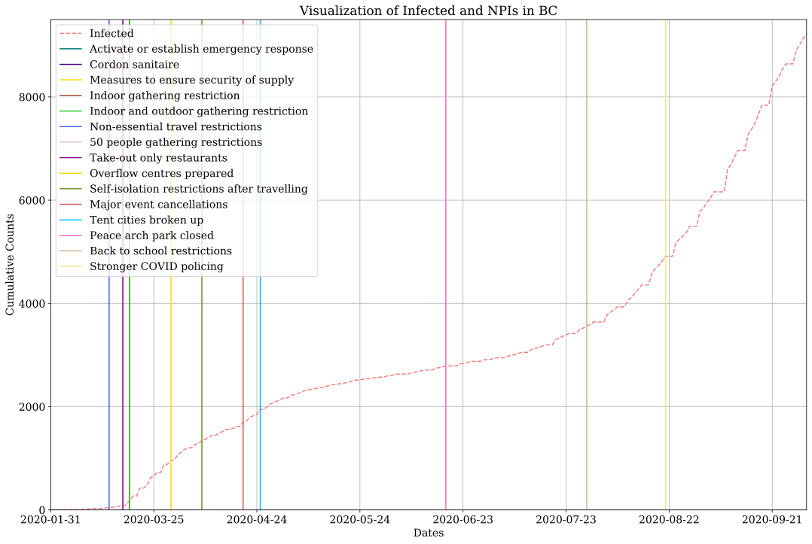


## Discussion
In this section we will analyze the Figure presented above. At first glance, it is difficult to attribute any change in the curve to an NPI. This makes sense. Since there are so many additional factors at play the curve will change in ways that we cannot anticipate based on this small subset of events. 

COVID was more infective in the winter months than in the summer months. Some are speculating that the infection rate of COVID-19 is seasonal: https://earthobservatory.nasa.gov/images/147066/could-covid-19-have-seasons. This was not taken into account by the model. Other reasons for the increase/decrease in transmission of the virus are seasonal responsibilities. Most notably, school starts in early September. From the graph above, we can that the exponential growth in cases continues through September and onwards. Sports like hockey, Canada's game, also start up in September. Another major reason for the unpredictible nature of the curve is our lack of testing. If we had perfect testing rates then the plot would look smoother and the strange un-exponential behaviour occurring in March and April might have looked different. These additional factors, among many others, may be responsible for the unpredictible nature of the curve.

Nonetheless, we can still draw some meaningful conclusions from the Figure above. Consider the first two NPIs, non-essential travel restrictions and shifting to take-out only restaurants. Immediately following these events we can see a huge uptick in transmission. This uptick, while not expected immediately following restrictions, is due to the other previously mentioned factors. With respect to the motive behind these restrictions, it is likely that the BC government, in conjunction with other health agencies, predicted an uptick in cases. To combat this uptick, which is clearly evident in the Figure above, these interventions were passed. 

Consider the measures in the Figure above. The vast majority of these measures were implemented in March and April. At this time, COVID was still a novel virus and little was known about it. The facilities that were needed to support the influx of COVID infected citizens was not yet available. Since the virus is far more likely to be fatal without the correct facilities, by implementing these policies, the BC governement likely reduced the number of fatalities. Further, the once blitzed hospital facilties were able to prepare for the surge of new patients. 

Also, as a result of these polcies, we can see the curve level off in late-April/early-May. This could be a result of the measures enacted. It could also be a result of the seasonal nature of the virus or some other factor, like the conclusion of the 2019-2020 school year. Moving into the start of the 2020-2021 school year, we can see that the BC government enacted back-to-school restrictions in early August and more aggressive COVID policing policies in mig-August. These measures might have been in response to an anticipated increase in social interaction as the new school year began. 

# Recommended Course of Action
To make a well-informed decision with respect to lock-downs/re-openings, we must define our goal. Our goal is to prioritize the number of fatalities while also minimizing the number of infected persons and the impact of the imposed restrictions on everyday life. Thus, we must define policies that are effective in reducing the transmission of the virus while ensuring that the value of the restrictions imposed is justified by the cost that they incur on society. 

In "The Hammer and the Dance" by Tomas Pueyo (https://tomaspueyo.medium.com/coronavirus-the-hammer-and-the-dance-be9337092b56), he talks about how many favor a mitigation strategy, i.e., imposing light restrictions so that the virus doesn't overcome the capacity of the hospitals. This is what the BC government has done. Most facilities and services remain open, at least in some capacity, and the curve continues to slowly grow. Another strategy is to completely suppress the virus through aggressive policies over a short period of time. This strategy has proven to be very effective in certain locations. Given that the vaccine for the virus has been released and is already being deployed, that school is in session, and that BC residents have become accustomed to the current level of restrictions, completely suppressing the virus does not make a lot of sense. 

Instead, we could take a hybrid approach to completely flatten the curve so that the transmission rate levels off. In South Korea, for example, this strategy completely flattened the curve that they first experienced during the initial wave. To make a data driven decision, we will use South Korea as a model for restrictions. We will visualize the frequency of the restrictions in South Korea and discuss some of the restrictions that were implemented in South Korea, but not in BC. 


```python
print(gb.head(), "\n")
sk = gb[gb["Country/Region"] == "Korea, South"].transpose()[4:].reset_index().rename(columns={"index": "date", 157: "infected"})
print(sk.head())
```

      Province/State Country/Region       Lat       Long  1/22/20  1/23/20  \
    0            NaN    Afghanistan  33.93911  67.709953        0        0   
    1            NaN        Albania  41.15330  20.168300        0        0   
    2            NaN        Algeria  28.03390   1.659600        0        0   
    3            NaN        Andorra  42.50630   1.521800        0        0   
    4            NaN         Angola -11.20270  17.873900        0        0   
    
       1/24/20  1/25/20  1/26/20  1/27/20  ...  11/22/20  11/23/20  11/24/20  \
    0        0        0        0        0  ...     44706     44988     45280   
    1        0        0        0        0  ...     32761     33556     34300   
    2        0        0        0        0  ...     74862     75867     77000   
    3        0        0        0        0  ...      6256      6304      6351   
    4        0        0        0        0  ...     14493     14634     14742   
    
       11/25/20  11/26/20  11/27/20  11/28/20  11/29/20  11/30/20  12/1/20  
    0     45490     45716     45839     45966     46215     46498    46717  
    1     34944     35600     36245     36790     37625     38182    39014  
    2     78025     79110     80168     81212     82221     83199    84152  
    3      6428      6534      6610      6610      6712      6745     6790  
    4     14821     14920     15008     15087     15103     15139    15251  
    
    [5 rows x 319 columns] 
    
          date infected
    0  1/22/20        1
    1  1/23/20        1
    2  1/24/20        2
    3  1/25/20        2
    4  1/26/20        3
    


```python
print(gb_events.head())
print(gb_events.Country.unique())
sk_events = gb_events[gb_events["Country"] == "South Korea"]
sk_events.head()
```

       id  Country iso3    State   Region       Date  \
    0   1  Albania  ALB  Albania  Albania 2020-02-25   
    1   2  Albania  ALB  Albania  Albania 2020-02-25   
    2   3  Albania  ALB  Albania  Albania 2020-02-25   
    3   4  Albania  ALB  Albania  Albania 2020-02-25   
    4   5  Albania  ALB  Albania  Albania 2020-03-08   
    
                                              Measure_L1  \
    0                                 Risk communication   
    1                                Resource allocation   
    2              Healthcare and public health capacity   
    3  Case identification, contact tracing and relat...   
    4                                 Travel restriction   
    
                                             Measure_L2  \
    0  Educate and actively communicate with the public   
    1                           Crisis management plans   
    2           Adapt procedures for patient management   
    3                              Airport health check   
    4                               Airport restriction   
    
                                   Measure_L3  \
    0     Encourage self-initiated quarantine   
    1         Financial aid for health system   
    2             Implement triage procedures   
    3  Specific health channel for travellers   
    4   Cancellation of international flights   
    
                                              Measure_L4 Status  \
    0           Travelers returning from high risk areas    NaN   
    1              Funds to increase availability of PPE    NaN   
    2                                     Health hotline    NaN   
    3            National passengers arriving from China    NaN   
    4  Partial cancellation of international flights:...    NaN   
    
                                                 Comment  \
    0  "The head of the National Medical Emergency Ce...   
    1  "Albanian Ministry of Health and Social Protec...   
    2  He clarified that when people notice symptoms,...   
    3  " Albanian citizens arriving from China, Singa...   
    4  Government stopped all flights with quarantine...   
    
                                                  Source  
    0  https://balkaneu.com/albania-national-medical-...  
    1  https://balkaneu.com/albania-national-medical-...  
    2  https://balkaneu.com/albania-national-medical-...  
    3  https://balkaneu.com/albania-national-medical-...  
    4  https://tvklan.al/ndalohen-fluturimet-me-10-de...  
    ['Albania' 'Austria' 'Belgium' 'Bosnia and Herzegovina' 'Brazil' 'Canada'
     'China' 'Croatia' 'Czech Republic' 'Denmark' 'Diamond Princess' 'Ecuador'
     'Egypt' 'El Salvador' 'Estonia' 'Finland' 'France' 'Germany' 'Ghana'
     'Greece' 'Honduras' 'Hong Kong' 'Hungary' 'Iceland' 'India' 'Indonesia'
     'Italy' 'Japan' 'Kazakhstan' 'Kosovo' 'Kuwait' 'Liechtenstein'
     'Lithuania' 'Malaysia' 'Mauritius' 'Mexico' 'Montenegro' 'Netherlands'
     'New Zealand' 'North Macedonia' 'Norway' 'Poland' 'Portugal'
     'Republic of Ireland' 'Romania' 'Senegal' 'Serbia' 'Singapore' 'Slovakia'
     'Slovenia' 'South Korea' 'Spain' 'Sweden' 'Switzerland' 'Syria' 'Taiwan'
     'Thailand' 'United Kingdom' 'United States of America']
    


<div>
<style scoped>
    .dataframe tbody tr th:only-of-type {
        vertical-align: middle;
    }

    .dataframe tbody tr th {
        vertical-align: top;
    }

    .dataframe thead th {
        text-align: right;
    }
</style>
<table border="1" class="dataframe">
  <thead>
    <tr style="text-align: right;">
      <th></th>
      <th>id</th>
      <th>Country</th>
      <th>iso3</th>
      <th>State</th>
      <th>Region</th>
      <th>Date</th>
      <th>Measure_L1</th>
      <th>Measure_L2</th>
      <th>Measure_L3</th>
      <th>Measure_L4</th>
      <th>Status</th>
      <th>Comment</th>
      <th>Source</th>
    </tr>
  </thead>
  <tbody>
    <tr>
      <th>6270</th>
      <td>6271</td>
      <td>South Korea</td>
      <td>KOR</td>
      <td>South Korea</td>
      <td>Cheongdo Daenam</td>
      <td>2020-02-20</td>
      <td>Environmental measures</td>
      <td>Environmental cleaning and disinfection</td>
      <td>Disinfect health and care facilities</td>
      <td>Disinfect hospitals</td>
      <td>NaN</td>
      <td>At the same time, the patient and staff at Che...</td>
      <td>https://www.cdc.go.kr/board/board.es?mid=a3040...</td>
    </tr>
    <tr>
      <th>6271</th>
      <td>6272</td>
      <td>South Korea</td>
      <td>KOR</td>
      <td>South Korea</td>
      <td>Daegu</td>
      <td>2020-02-19</td>
      <td>Resource allocation</td>
      <td>Activate or establish emergency response</td>
      <td>Risk management plan</td>
      <td>Set up crisis unit (regional)</td>
      <td>NaN</td>
      <td>The central government(MOHW, KCDC) was dispatc...</td>
      <td>https://www.cdc.go.kr/board/board.es?mid=a3040...</td>
    </tr>
    <tr>
      <th>6272</th>
      <td>6273</td>
      <td>South Korea</td>
      <td>KOR</td>
      <td>South Korea</td>
      <td>Daegu</td>
      <td>2020-02-19</td>
      <td>Case identification, contact tracing and relat...</td>
      <td>Quarantine</td>
      <td>Contact persons</td>
      <td>NaN</td>
      <td>NaN</td>
      <td>Service members in South Korea who-ve attended...</td>
      <td>https://www.militarytimes.com/news/your-milita...</td>
    </tr>
    <tr>
      <th>6273</th>
      <td>6274</td>
      <td>South Korea</td>
      <td>KOR</td>
      <td>South Korea</td>
      <td>Daegu</td>
      <td>2020-02-20</td>
      <td>Healthcare and public health capacity</td>
      <td>Increase healthcare workforce</td>
      <td>Mobilization of domestic resources for health</td>
      <td>Recruitment of healthcare workers on the front...</td>
      <td>NaN</td>
      <td>NaN</td>
      <td>https://translate.google.co.uk/translate?sl=ko...</td>
    </tr>
    <tr>
      <th>6274</th>
      <td>6275</td>
      <td>South Korea</td>
      <td>KOR</td>
      <td>South Korea</td>
      <td>Daegu</td>
      <td>2020-02-20</td>
      <td>Healthcare and public health capacity</td>
      <td>Enhance laboratory testing capacity</td>
      <td>Increase laboratory facilities</td>
      <td>More laboratories dedicated</td>
      <td>NaN</td>
      <td>in total 22 virus-detection centers in Daegu</td>
      <td>https://translate.google.co.uk/translate?sl=ko...</td>
    </tr>
  </tbody>
</table>
</div>


```python
print(sk_events.shape)
```

    (101, 13)
    


```python
sk_events = gb_events[gb_events["Country"] == "South Korea"]

print(sk_events.Measure_L3.isna().sum())

rows_with_nan = []
for i in range(sk_events.shape[0]):
    if sk_events.Measure_L3.iloc[i] is np.nan: 
        rows_with_nan.append(i)
print(rows_with_nan)

sk_events.Measure_L3.iloc[11] = sk_events.Measure_L2.iloc[11]

print(sk_events.Measure_L3.isna().sum())

sk_events = sk_events.rename(columns={"Date": "date", "Measure_L3": "name", "Measure_L1": "e_type", "Source": "source"})
sk_events = sk_events[["date", "name", "e_type", "source"]]

print(sk_events.date.head())

def stringify_dates(date):
    return str(date)[:len("2020-02-20")]

sk_events.date = sk_events.date.map(stringify_dates)

print(sk_events.date.head())
```

    1
    [11]
    0
    6270   2020-02-20
    6271   2020-02-19
    6272   2020-02-19
    6273   2020-02-20
    6274   2020-02-20
    Name: date, dtype: datetime64[ns]
    6270    2020-02-20
    6271    2020-02-19
    6272    2020-02-19
    6273    2020-02-20
    6274    2020-02-20
    Name: date, dtype: object
    


```python
sk = gb[gb["Country/Region"] == "Korea, South"].transpose()[4:].reset_index().rename(columns={"index": "date", 157: "infected"})

def reformat_date_str(date):
    date = str(date)

    month = date[:date.index("/")]
    if len(month) == 1:
        month = "0" + month

    date = date[date.index("/")+1:] 
    day = date[:date.index("/")]
    if len(day) == 1:
        day = "0" + day
        
    year = date[date.index("/")+1:]

    return "20" + year + "-" + month + "-" + day

sk.date = sk.date.map(reformat_date_str)
```


```python
color_array = ["teal", "indigo", "gold", "sienna", "limegreen", "royalblue", "thistle", "darkmagenta", "gold", "olivedrab", "indianred", "deepskyblue", "hotpink", "tan", "khaki"] * 100

plt.figure(figsize=(18, 12))

plt.plot(sk["date"], sk["infected"], color="lightcoral", label="Infected", linestyle="dashed")

type_array = sk_events.e_type.unique()

type_color_dict = dict()
labelled_dict = dict()

for i in range(len(type_array)):
    type_color_dict[type_array[i]] = color_array[i]
    labelled_dict[type_array[i]] = False

ax = plt.gca()
for i in range(sk_events.shape[0]):
    if labelled_dict[sk_events.e_type.iloc[i]] == False:
        ax.axvline(x=sk_events.date.iloc[i], label=sk_events.e_type.iloc[i], color=type_color_dict[sk_events.e_type.iloc[i]])
        labelled_dict[sk_events.e_type.iloc[i]] = True
    else:
        ax.axvline(x=sk_events.date.iloc[i], color=type_color_dict[sk_events.e_type.iloc[i]])

ax.set_xticks(np.arange(sk.shape[0], step=30))


plt.rcParams.update(font)
plt.rcParams["legend.loc"] = "upper left"
plt.title("Visualization of Infected Persons and NPIs in South Korea")
plt.xlabel("Dates")
plt.ylabel("Cumulative Counts")
plt.xlim(left="2020-01-22", right="2020-05-01")
plt.ylim(bottom=0, top=12000)
plt.legend()
plt.grid(True)
plt.show()
```


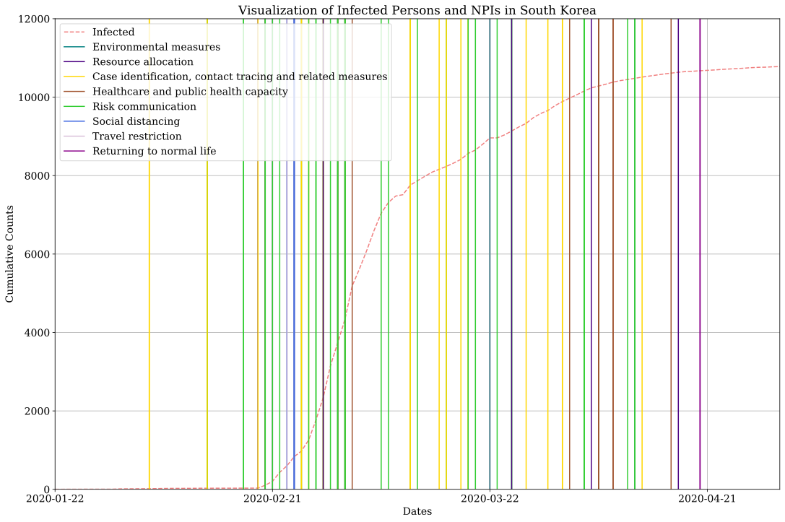


From the Figure above, we can see that the curve is initially aggressively increasing into the 10s of thousands. This is where BC is currently headed. As soon as the virus begins to grow, however, the South Korean government acts rapidly with aggressive policies. From this Figure, we can see the impressive frequency of government intervention. Notice that a significant number of these interventions are under the "Risk communication" category. These interventions are shown below:


```python
print(sk_events[sk_events.e_type == "Risk communication"].name.values)
```

    ['Promote social distancing measures'
     'Covid-19-appropriate behaviour campaign'
     'Guidelines for persons in quarantine'
     'Sensitization of hospital, medico-social and liberal health professionals'
     'Guidelines: general recommendations'
     'Encourage self-initiated quarantine'
     'Encourage self-initiated quarantine' 'Guidelines for travellers'
     'Inform and/or answer to questions' 'Respiratory etiquette'
     'Inform and/or answer to questions'
     'Health agencies and emergency healthcare'
     'Inform and/or answer to questions' 'Respiratory etiquette'
     'Encourage stay at home' 'Encourage stay at home'
     'Promote self-initiated isolation of people with mild respiratory symptoms'
     'Encourage hand hygiene' 'Respiratory etiquette'
     'Guidelines for persons in quarantine' 'Guidelines on national strategy'
     'Organize notification' 'Promote social distancing measures'
     'Promote workplace safety measures'
     'Guidelines for work-safety protocols'
     'Promote social distancing measures' 'Discourage non-essential travels'
     'Health alert notice to international travellers'
     'Promote social distancing measures' 'Inform and/or answer to questions'
     'Encourage environmental disinfection'
     'Encourage self-initiated quarantine'
     'Promote hygiene measures and social distancing'
     'Promote social distancing measures'
     'Encourage self-initiated quarantine'
     'Encourage environmental disinfection'
     'Guidelines for medical and paramedical centers'
     'Promote hygiene measures and social distancing'
     'Communication targets protection of vulnerable populations'
     'Promote social distancing measures'
     'Guidelines for adminstrative procedures']
    

Aside from the frequency of the interventions, South Korea's approach to controlling the virus differs primarily in their social distancing ideas and contact tracing efforts. South Korea took a data driven approach to tackling the virus by implementing a rigorous contact tracing system. Consider their contact tracing interventions:


```python
print(sk_events[sk_events.e_type == "Case identification, contact tracing and related measures"].name.values)
```

    ['Contact persons'
     'Health evaluation of people before access to transports/institutions'
     'Contact tracking' 'Targeted testing' 'Isolation of cases'
     'Contact tracking' 'Contact persons' 'Contact tracing'
     'Incomings from high-risk areas' 'Health screening at the airport'
     'Patients with symptoms or/and epidemiological link'
     'Health questionnaire at the border'
     'Specific health channel for travellers'
     'Tracking and monitoring travellers'
     'Specific health channel for travellers'
     'Specific health channel for travellers'
     'Temperature screening at airport' 'Temperature screening at the border'
     'Test travellers' 'Test at the border' 'Test at the border'
     'Incomings from high-risk areas' 'Test at the border'
     'Incoming national citizens and/or residents' 'Test at the border']
    

In South Korea, they have targetting testing, aggressive case isolation, tests at the border, a specific health channel for travellers, contact tracking, and groups of contact persons that seek out exposed citizens. These efforts allow the government to identify where the virus is prevalent. Then, social distancing measures can be enforced in those areas. In BC, work has not resumed anywhere. People still wear masks and social distance in areas that have no COVID at all. By implementing rigorous contact tracing programs in BC, we can formulate a plan for the rest of our policies. 

As such, I propose the following. 

1. BC must formualte some sort of contact tracing organization complete with contact persons, data analysts, and all personal in between
2. Mandate testing all accross the province and especially in high-risk areas
3. Using the information from the contact tracing organization and the new testing data, isolate the types of events that are causing the spread, and stop them

If this proposition is followed, hundreds of thousands of lives could be saved in the long-term. In the worse case, five-hundred thousand people die in BC. If the curve is completely flattened, more than half of these lives could be spared. Implementing these policies does, however, come with an initial cost of privacy and convenience. In order for a data driven plan like this to work, everyone must be on board with it. If the residents of BC can get on board with mandatory testing and contact tracing, then this plan will succeed and many will be saved. Otherwise, this plan will fail and many lives will be lost.
